# Membuat Akun Mastodon

Mari kita mulai dengan membuat sebuah akun di peladen mastodon.social.

Akses website https://mastodon.social/ melalui peramban kita. Setelah website termuat, klik ***Create account***. Kamu juga bisa scroll-scroll ke bawah untuk melihat apa saja yang sedang hangat di Mastodon, sebelum membuat akun.

  

    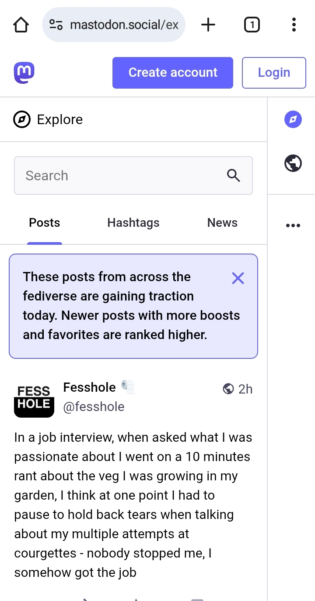
  

Sebelum kita membuat akun, adakalanya kita mesti membaca beberapa daftar aturan yang berlaku di peladen tersebut. Aturan ini dapat berbeda-beda di setiap peladen.

  

    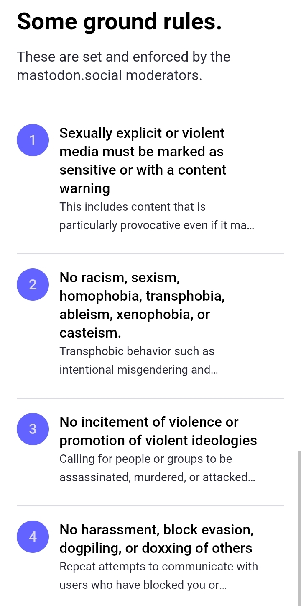
    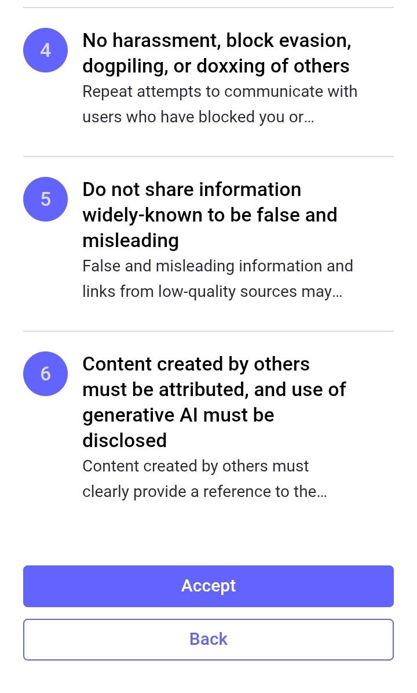
  

Namun karena kita membuat akun di peladen mastodon.social, berikut adalah aturan yang berlaku:

1. **Media seksual eksplisit atau kekerasan harus ditandai sebagai sensitif atau dengan peringatan konten**. Bila kamu ingin mengunggah konten yang mengandung seksual, kekerasan, maupun hal sensitif lainnya, kita mesti memberikan sebuah tanda peringatan (semacam trigger warning) bahwa postingan tersebut mengandung hal-hal yang sensitif. Penjelasan mengenai memberikan tanda peringatan dapat disimak pada [halaman berikut](https://github.com/bandarbaru-1/Panduan-Mastodon-Indonesia/blob/main/pages/10%20-%20Membuat%20Postingan%20Dengan%20Tanda%20Peringatan.md).
2. **Tidak ada rasisme, seksisme, homofobia, transfobia, ableisme, xenofobia, atau kasta**. Mohon hargai sesama pengguna. Sekalipun kamu mungkin tidak setuju dengan pandangan homoseksual & transgender, dimohon untuk menghargai keberadaan mereka.
3. **Tidak ada hasutan kekerasan atau promosi ideologi kekerasan**.
4. **Tidak ada pelecehan, penggelapan blok, dogpiling, atau doxxing orang lain**. Jangan membuat onar.
5. **Jangan berbagi informasi yang dikenal secara luas sebagai salah dan menyesatkan**.
6. **Konten yang dibuat oleh orang lain harus dikaitkan, dan penggunaan AI generatif harus diungkapkan**. Bila kamu memposting sebuah konten yang di ambil dari sumber internet atau lainnya (bukan milikmu), usahakan untuk memberikan kredit. Bila kamu memposting konten yang di-generate oleh AI, berikan pernyataan yang jelas di dalam postingan bahwa konten tersebut adalah konten yang dibuat oleh AI.

Setelah kamu membaca dan merasa tidak keberatan dengan peraturan tersebut, kilk **Accept** untuk melanjutkan.

Barulah kamu mulai memasukkan nama pengguna yang kamu inginkan, alamat surel yang kamu miliki, kata sandi yang akan kamu gunakan, serta masukkan tanggal lahir.

  

    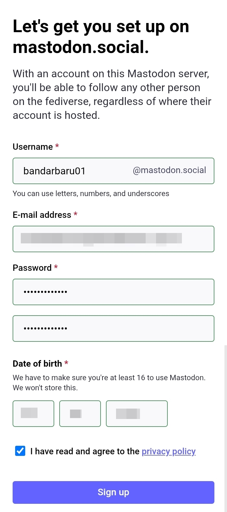
  

Sebagai catatan, nama pengguna yang nanti akan kalian gunakan akan memiliki akhiran nama peladen. Seperti di sini contoh, saya memilih menggunakan nama pengguna '@bandarbaru01', maka nantinya, nama pengguna lengkapnya adalah: `@bandarbaru01@mastodon.social` (berbeda seperti di Twitter yang mungkin hanya @bandarbaru01 saja).

Terdapat catatan bahwa untuk menggunakan Mastodon, pastikan kamu telah berusia 16 tahun ke atas, dan karena alasan privasi, tanggal lahir yang dimasukkan tidak akan disimpan oleh mereka mereka.

Jika sudah, (bila perlu) baca kebijakan privasi mereka, kemudian setujui kebijakan tersebut lalu klik ***Sign up***.

  

    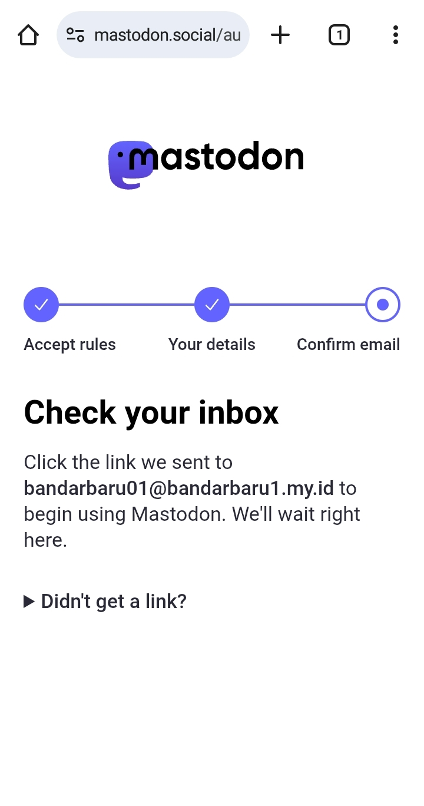
  

Jika sudah, silahkan periksa surel kalian & buka surel konfirmasi mastodon.social, kemudian klik ***Verify email address*** untuk mengaktifkan akun Mastodon-mu.

  

    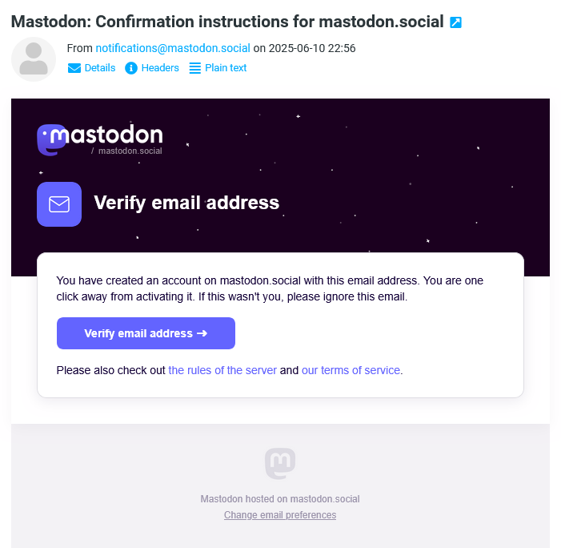
  

Namun bila belum menerima surel konfirmasi, kita bisa periksa kembali apakah alamat surel-nya sudah benar atau tidak. Jika tidak, maka koreksi alamat surel-nya. Jika alamat surel-mu sudah benar, maka klik ***Resend confirmation link***.

  

    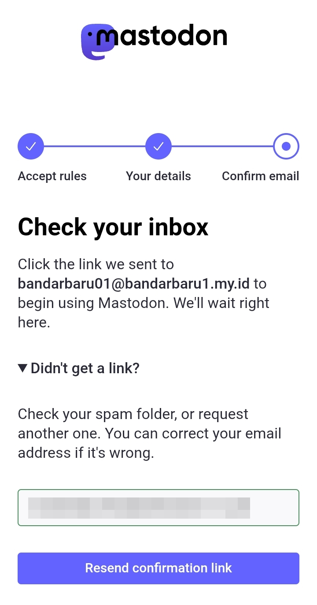
  

Selesaikan captcha, lalu klik ***Continue***.

  

    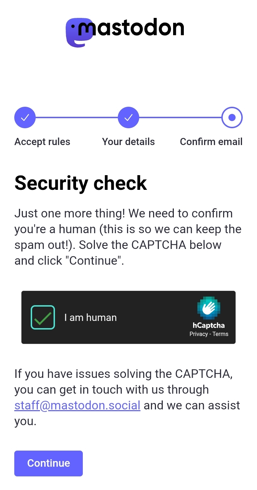
  

Dan akun Mastodon berhasil dibuat!

  

    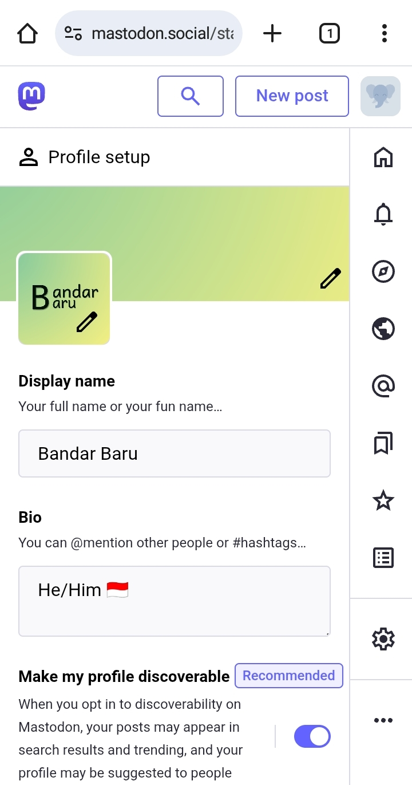
  

Sekarang, kita unggah foto profil, foto banner/sampul, nama akun, serta bio.

Terdapat pilihan *Make my profile discoverable*, jika kita mengaktifkan ini, maka aku kita dapat tampil di hasil pencarian, trending, dan di daftar rekomendasi di beberapa pengguna.

Jika kita memilih untuk menjadikan akunmu sebagai akun privat, nonaktifkan ini.

Jika sudah, klik ***Save and continue***.

  

    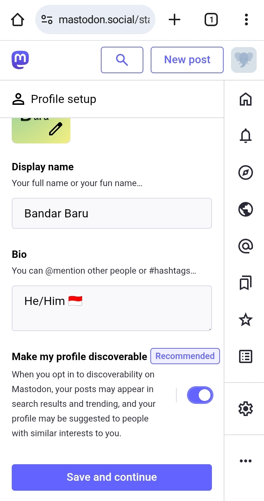
  

Setelah itu, muncullah beberapa akun rekomendasi untuk diikuti. Karena kita berada di mastodon.social, maka biasanya akun-akun yang direkomendasikan adalah akun-akun populer di peladen tsb. dan biasanya adalah orang-orang luar. Kita bisa mengikuti mereka, atau silahkan scroll ke bawah lalu klik ***Done*** untuk selesai atau melewati itu.

  

    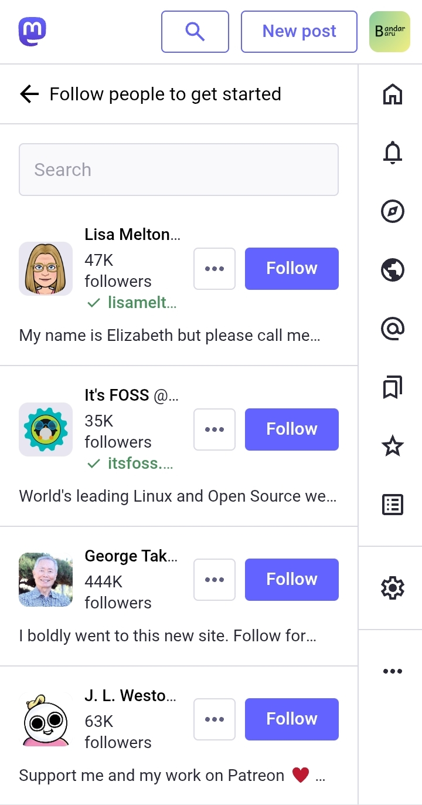
    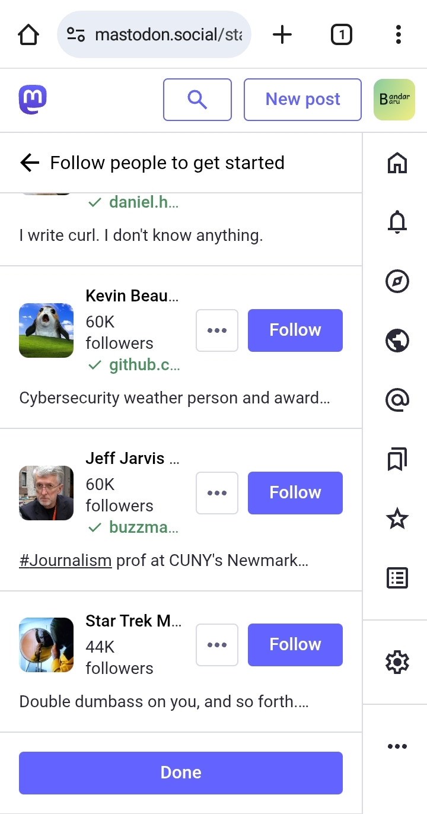
  

> Saya sudah mengkurasi beberapa akun yang dapat kalian cari dan ikuti di [halaman berikut](https://github.com/bandarbaru-1/Panduan-Mastodon-Indonesia/blob/main/pages/20%20-%20Rekomendasi%20Akun%20Yang%20Dapat%20Diikuti.md).

Dan selesai, akun Mastodon kita siap digunakan!

  

    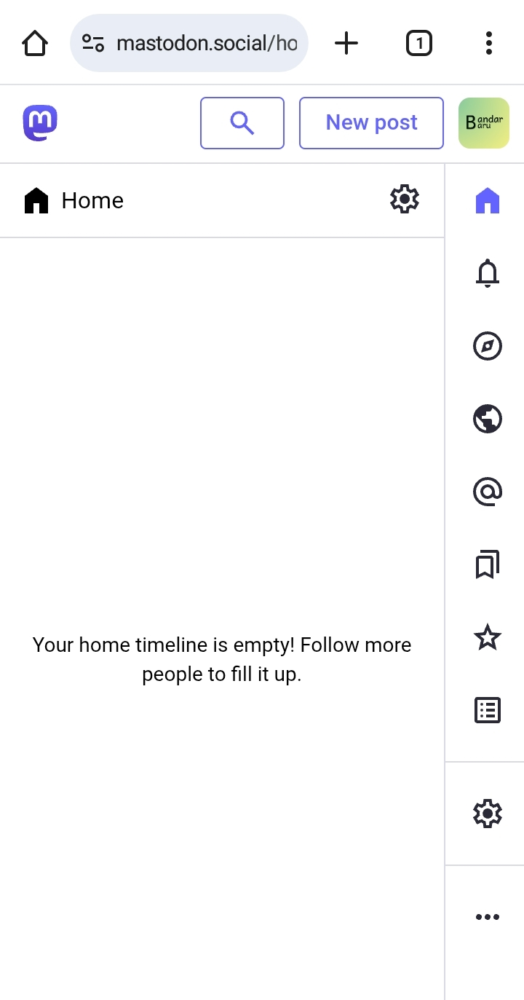
  

