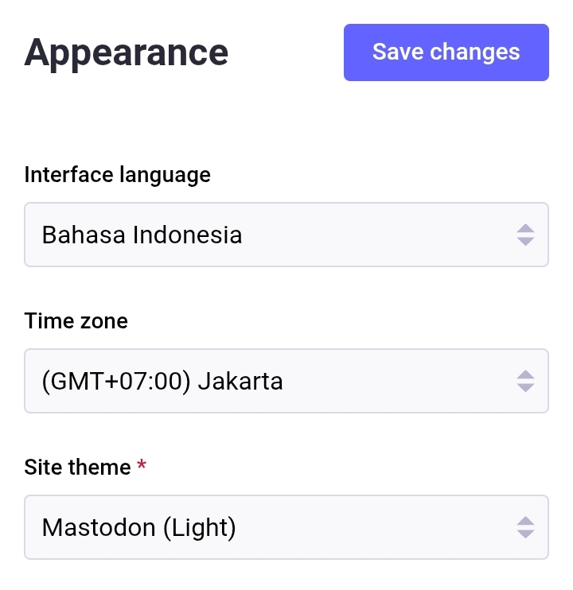

# Mengatur Aturan Tampilan & Bahasa
Sekarang kita akan bermain di pengaturan. Klik menu -> *Preferences*.

  

    
    
  

Saat kita ke menu pengaturan, kita pertama diarahkan menuju ke menu pengaturan *Appearance*.

  

    
  

Mari kita ubah interface language ke **Bahasa Indonesia**, time zone ke **(GMT+07:00) Jakarta** untuk Waktu Indonesia Barat (WIB) (atau **(GMT+08:00) Beijing** untuk Waktu Indonesia Tengah (WITA) atau **(GMT+09:00) Osaka** untuk Waktu Indonesia Timur (WIT)), dan *site theme* sesuai selera masing-masing (pilihan tema warna-nya ada *automatic, dark, high contrast, & light*).

  

    
  

*Advanced Web Interface* dapat diaktifkan jika kita mengakses Mastodon melalui peramban di komputer dan ingin mendapatkan tampilan seperti TweetDeck.

  

    
  

Contoh tampilan *Advanced Web Interface* di peramban komputer:

  

    
  

*Animation And Accessibility, Discovery, & Confirmation Dialogs* dapat kita atur sesuai selera.

  

    
  

Dan di bagian *Sensitive Content*. Terdapat 3 pilihan:
- ***Hide media marked as sensitive***. Konten yang telah ditandai sebagai sensitif akan muncul namun di-sensor. Kita mesti klik gambar tersebut untuk melihat-nya tanpa sensor.
- ***Always show media***. Konten sensitif akan muncul tanpa sensor.
- ***Always hide media***. Konten sensitif tidak akan muncul di linimasa.

  

    
  

> Penjelasan mengenai konten yang ditandai sensitif atau tanda peringatan dapat disimak di [halaman berikut](https://github.com/bandarbaru-1/Panduan-Mastodon-Indonesia/blob/main/pages/10%20-%20Membuat%20Postingan%20Dengan%20Tanda%20Peringatan.md).

Jika sudah klik ***Save Changes***.

Panduan berikutnya akan sepenuhnya menggunakan antarmuka tampilan Bahasa Indonesia.

  

    
  

