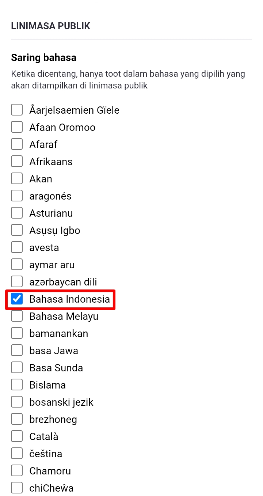

# Mengatur Aturan Postingan

Setelah mengubah pengaturan *Tampilan (Appearance)*, selanjutnya klik ikon menu di pojok kanan atas, lalu klik *Lainnya (Other)*.

  

    
    
  

Di menu ini, pengaturan yang akan saya bahas adalah pengaturan *Kiriman Bawaan (Posting Defaults)*. Pengaturan ini akan diaplikasikan ke pilihan postingan berikutnya. Jadi jika kamu memilih untuk setel privasi postingannya selain publik (*quiet public* atau *followers only*), atau setel bahasa postingan (English atau Bahasa Indonesia), kamu tidak lagi capek-capek mengubahnya lagi setiap kamu akan posting. Kamu bisa set pengaturannya di sini.

  

    
  

Penjelasan pilihan *set privasi postingan (posting privacy)*:
- ***Publik - Bisa dilihat semua orang (Public - Everyone can see)***. Ini secara bawaan/default, dan jika kamu memilih akun dan postingannya dapat diakses dan dicari oleh pengguna lainnya.
- ***Bisa dilihat semua orang, tapi tidak ditampilkan di linimasa publik - Tidak terdaftar di linimasa publik tetapi siapapun dapat melihat (Unlisted - Everyone can see, but not listed on public timelines)***. Ini sama seperti quiet public. Salah satu pilihan jika kamu mungkin ingin postingannya dilihat publik, tetapi di satu waktu, kamu ingin postingannya tidak mau tersebar secara luas.
- ***Khusus pengikut - Hanya tampilkan ke pengikut (Followers only - Only show to followers)***. Postingan berikutnya akan di setel hanya khusus pengikutmu saja yang melihat (kecuali kamu set manual ke public sebelum posting). Ini pilihan yang sangat penting apabila kamu ingin menjadikan akunmu privat.

  

    
  

Pilihan *bahasa posting (posting language)*, jika kamu menggunakan antarmuka Bahasa Indonesia, biarkan *Sama seperti bahasa antarmuka*. Namun jika kamu menggunakan antarmuka Bahasa Inggris, silahkan dipilih ke Bahasa Indonesia, agar berikutnya saat posting, tidak lagi capek-capek mengubahnya dari English ke Bahasa Indonesia.

Pilihan *who can quote*, ini seperti QRT atau Quote Retweet di Twitter, namun kita punya kontrol siapa saja yang bisa quote post postingan kita:
- ***Everyone***. Siapapun bias quote post postingan kita.
- ***Only your followers***. Hanya pengikut kita mention yang bisa quote post postingan kita.
- ***Nobody***. Tidak ada seorangpun yang bisa quote post postingan kita.

  

    
  

Sebagai catatan, pengaturan who can quote ini dimaksudkan untuk fitur QRT di Mastodon yang baru akan hadir di versi Mastodon yang akan datang. Namun pengaturan ini sudah dihadirkan sebagai bentuk persiapan. Penjelasan mengenai QRT di Mastodon dapat disimak di [halaman berikut](https://github.com/bandarbaru-1/Panduan-Mastodon-Indonesia/blob/main/pages/13%20-%20Mengutip%20Postingan%20Pengguna%20Lain.md).

Pengaturan *linimasa publik (public timelines)*, ini opsional, kita bisa centang Bahasa Indonesia dan kamu dapat membuka linimasa publik Bahasa Indonesia. Linimasa yang hanya memunculkan setiap postingan publik dari berbagai peladen yang di-set ke Bahasa Indonesia (mungkin ada postingan bahasa asing yang nyelip, mungkin pengaturan postingan yang mereka gunakan salah).

  

    
  

Karena ini pula-lah, kamu bisa discover dan mencari mutual atau kenalan baru sesama pengguna Indonesia di Mastodon.

Linimasa publik Berbahasa Indonesia per hari ini masih dipenuhi oleh spam-spam yang tidak jelas. Penjelasan bagaimana menggunakan linimasa publik (termasuk bagaimana bisu/blokir akun) dapat disimak di [halaman berikut](https://github.com/bandarbaru-1/Panduan-Mastodon-Indonesia/blob/main/pages/16%20-%20Menjelajahi%20Linimasa%20Publik%20dan%20Bisukan%20Blokir%20Akun.md). Sebagai alternatif, untuk mencari dan mengikutu akun-akun Berbahasa Indonesia di Mastodon/Fediverse, saya sudah mengkurasi beberapa akun yang dapat kalian ikuti di [halaman berikut](https://github.com/bandarbaru-1/Panduan-Mastodon-Indonesia/blob/main/pages/20%20-%20Rekomendasi%20Akun%20Yang%20Dapat%20Diikuti.md).

Jika sudah, scroll ke bawah lalu klik ***Simpan Perubahan (Save changes)***.

  

    
  

