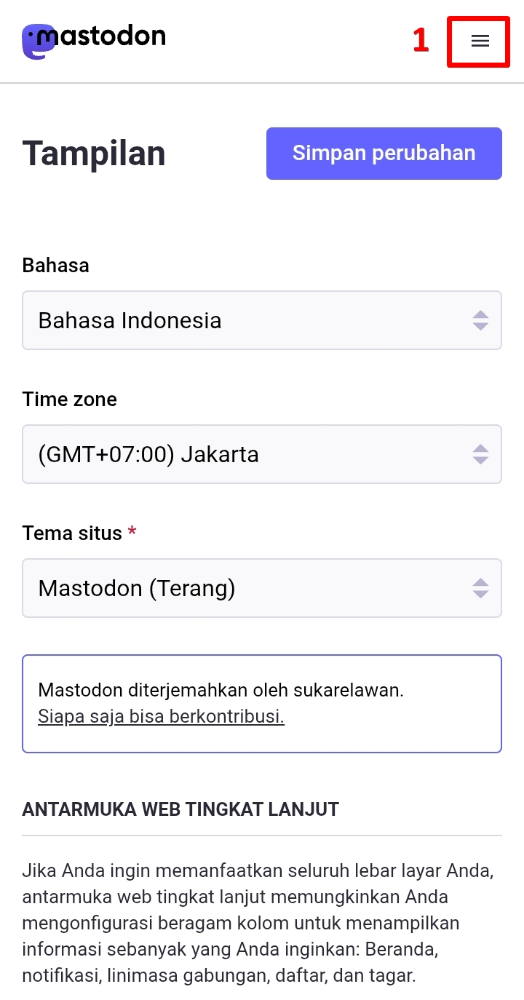
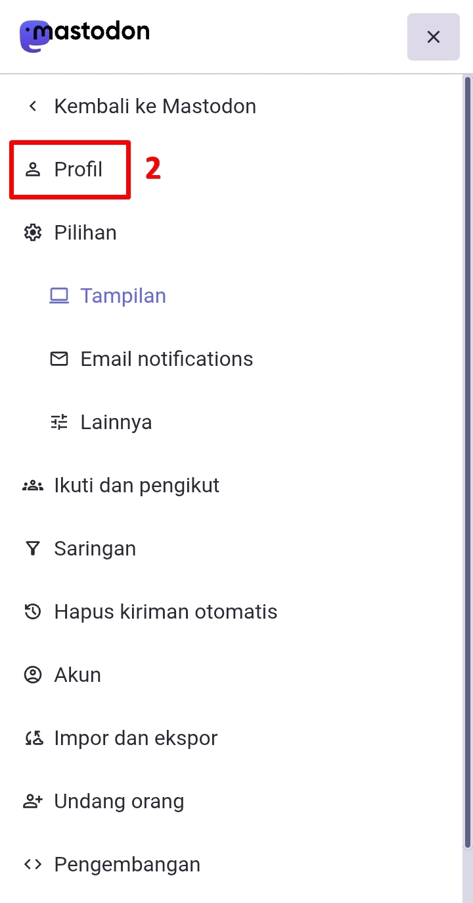
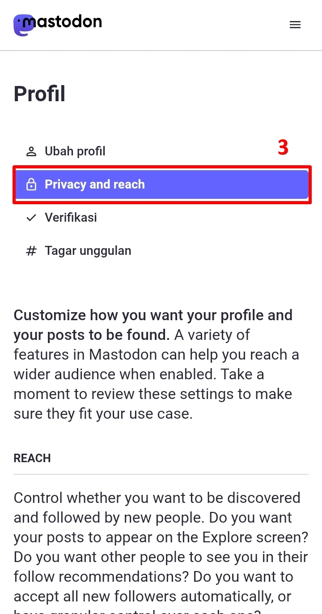
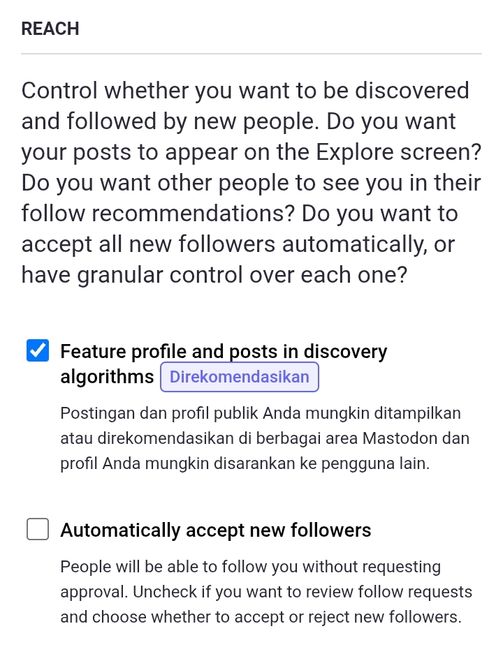
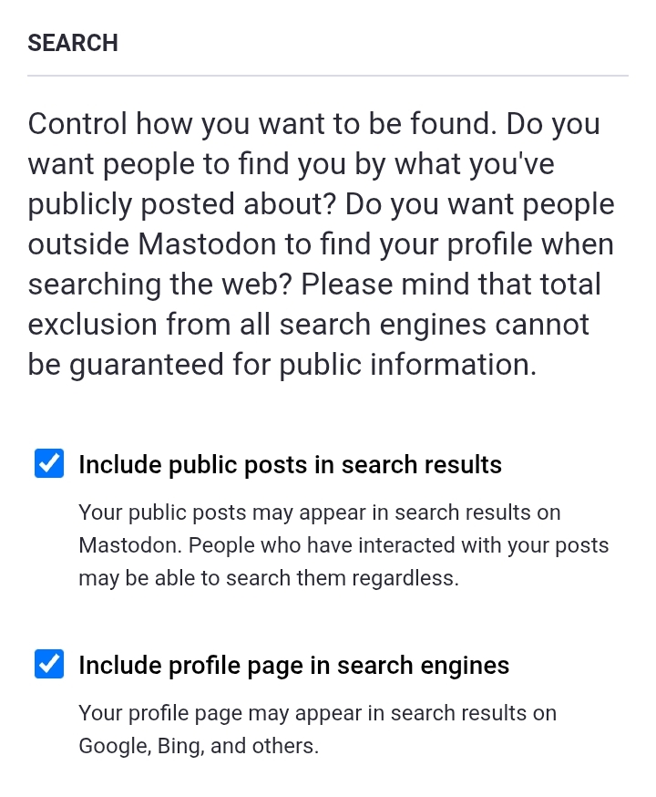
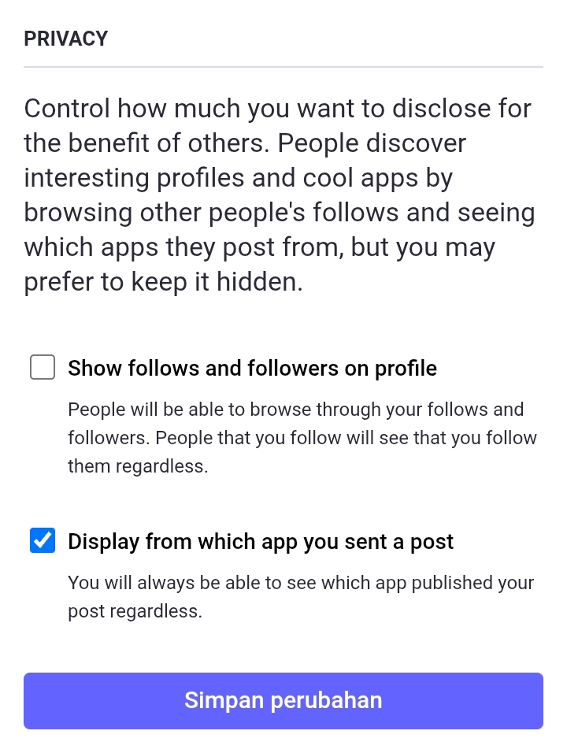

# Mengatur Privasi Akun

> Jika kalian ingin menjadikan akun kalian sepenuhnya privat, kalian bisa menyimak [halaman berikut](https://github.com/bandarbaru-1/Panduan-Mastodon-Indonesia/blob/main/pages/17%20-%20Panduan%20Sederhana%20Akun%20Privat.md) untuk penjelasan yang lebih sederhana.

Di menu pengaturan, klik ikon menu di pojok kanan atas, lalu klik *Profil (Public Profile)*, lalu klik *Privacy and reach*.

  

    
    
    
  

Mari kita scroll ke bagian *Reach*:
- ***Feature profile and posts in discovery algorithms***. Ini seperti pilihan set saat kita baru saja membuat akun. Jika kita tidak mau akun kita bisa dicari, masuk ke linimasa publik, atau tampil sebagai rekomendasi di pengguna lain, kita bisa matikan ini.
- ***Automatically accept new followers***. Ini terpenting! Jika kita ingin menjadikan akun kita privat (apalagi dilengkapi set posting default sebagai followers only), kita mesti matikan ini! Jadi setiap ada pengikut baru, mereka perlu persetujuan dulu sebelum menerima mereka mengikuti kalian.

  

    
  

Di bagian *Search*, ini sederhana saja. Jika kita ingin akun kita publik, biarkan tercentang. Jika ingin akun kita privat, matikan!

  

    
  

Di bagian *Privacy*:
- ***Show follows and followers on profile***. Dengan menonaktifkan ini, maka kita dapat menyembunyikan seluruh daftar orang yang kita ikuti dan pengikut kita. Hanya kita yang bisa lihat. Menambah privasi bagi kita.
- ***Display from which app you sent a post***. Dengan menonaktifkan ini, maka kita menyembunyikan, aplikasi apa yang kita gunakan untuk mengirim postingan. kita tetap bisa melihatnya, tetapi orang lain tidak.

  

    
  

Jika sudah, klik ***Simpan Perubahan (Save changes)***.

