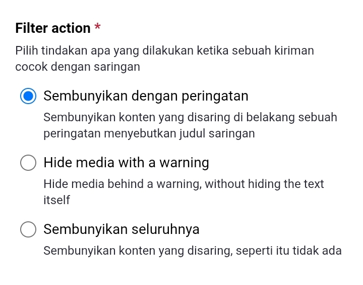
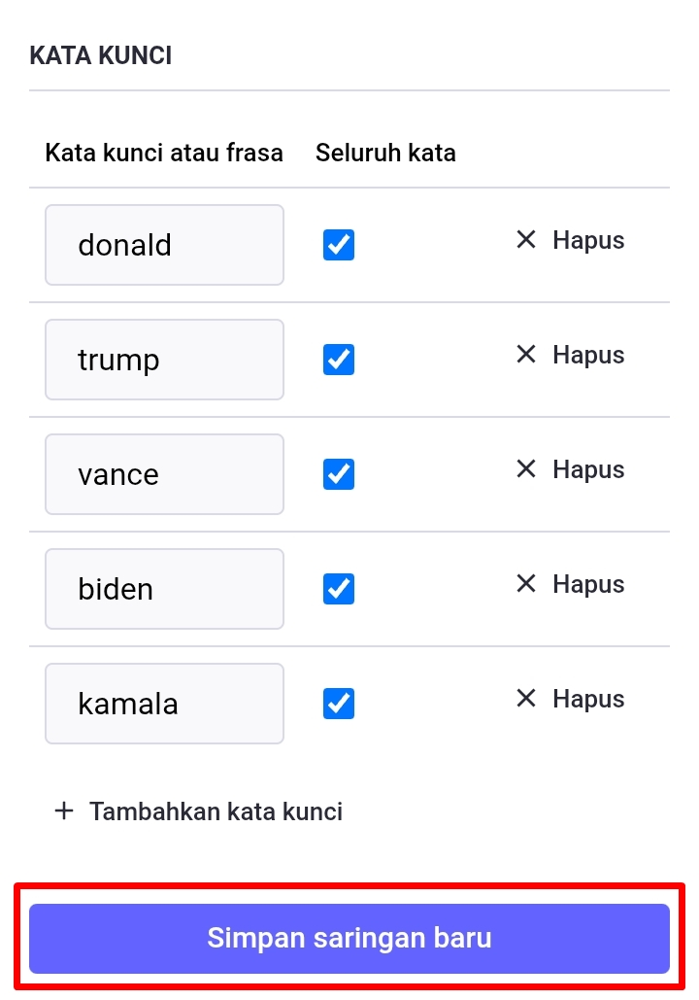

# Menyaring Postingan

Adakalanya kita mungkin ingin membisukan/memblokir sebuah kata dalam postingan. Maka yang kita dapat lakukan adalah mengatur saringan postingan.

Di menu pengaturan, klik ikon menu di pojok kanan atas, lalu klik *Saringan (Filters)*, setelah itu klik *Tambah saringan baru (Add new filter)*.

  

    
    
    
  

Misalnya kita ingin membisukan postingan yang menyebut tokoh-tokoh politik Amerika Serikat.

Di sini kita tulis *judul (title)* saringannya. Atur durasi penyaringan pada kolom *kedaluwarsa setelah (expire after)*, biarkan tersetel *tak pernah (never)* jika ingin mengaplikasikan saringan ini selamanya.

  

    
    
  

*Saring konteks (filter context)*, ini untuk menentukan di manakah saringan ini akan berfungsi: di *beranda (home & lists)*, *notifikasi (notifications)*, *linimasa publik (public timelines)*, *percakapan (conversations)*, & *profil (proflies)*. Kita bisa centang seluruhnya jika kita ingin menyembunyikannya di seluruh halaman.

  

    
  

Untuk penjelasan pilihan *filter action*:
- ***Sembunyikan dengan peringatan (Hide with a warning)***. Dengan memilih ini, maka postingan yang mengandung kata yang disaring akan diberikan tanda peringatan atau trigger warning yang kita mesti membuka isi lengkap postingan secara manual.
- ***Hide media with a warning***. Dengan memilih ini, maka postingan dengan gambar yang mengandung kata yang disaring akan di-blur, dan kita mesti klik gambarnya untuk membuka sensor-nya.
- ***Sembunyikan seluruhnya (Hide completely)***. Dengan memilih ini, maka seluruh postingan yang mengandung kata yang disaring, akan sepenuhnya disembunyikan. Tidak akan pernah tampil di layar kaca-mu.

  

    
  

Mari kita isi kata kunci postingan yang akan kita saring, dan jika sudah, klik ***Simpan saringan baru (Save new filter)***.

  

    
    
  

