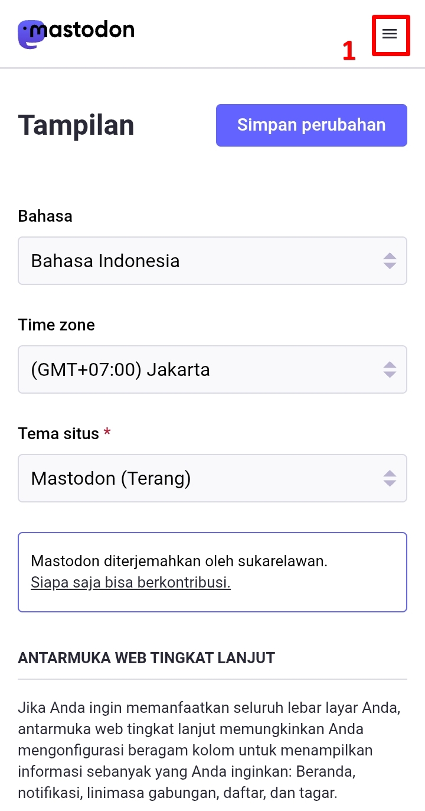
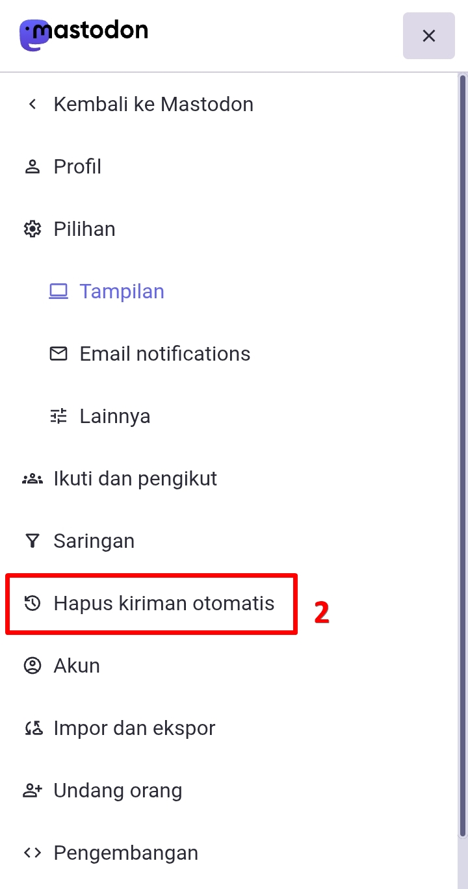
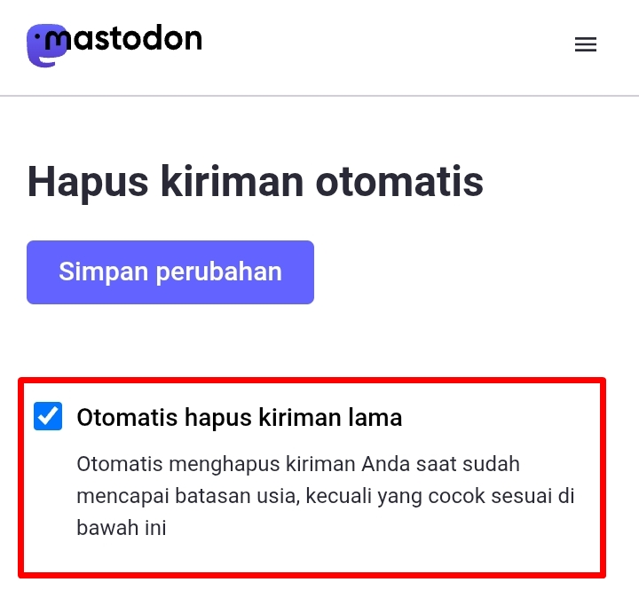
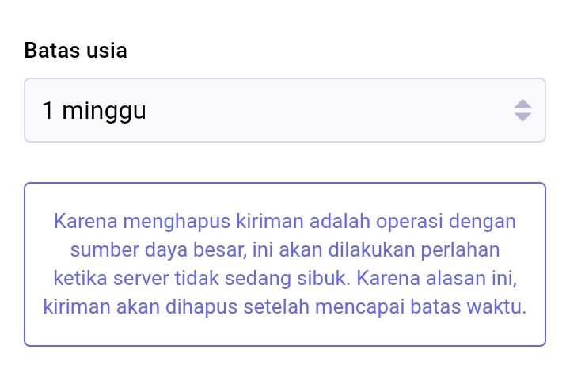
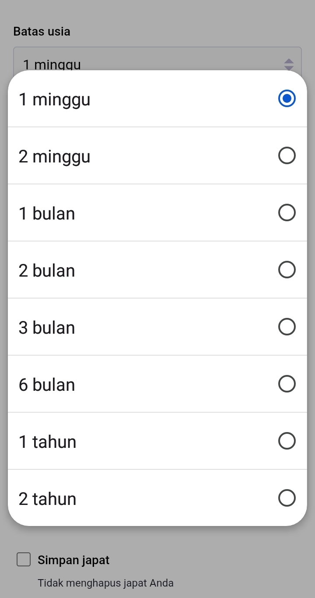
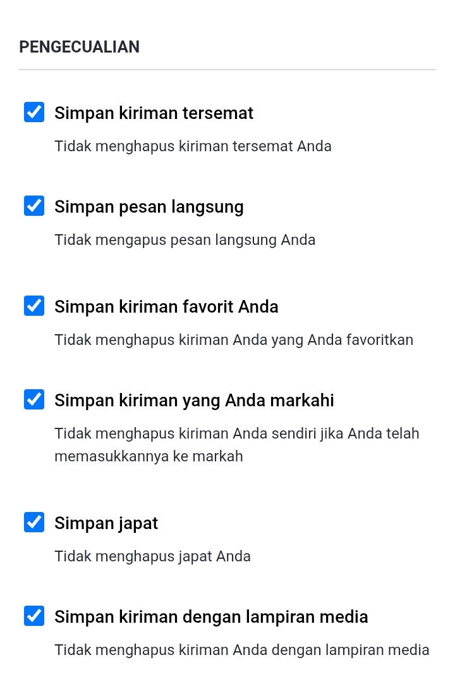
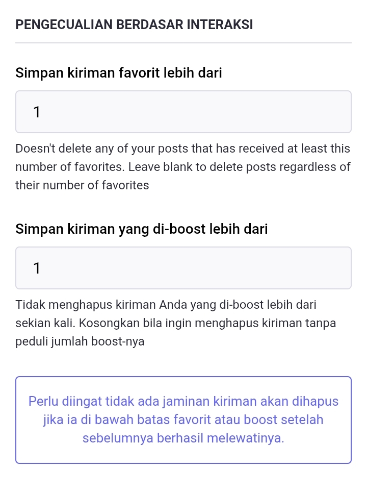
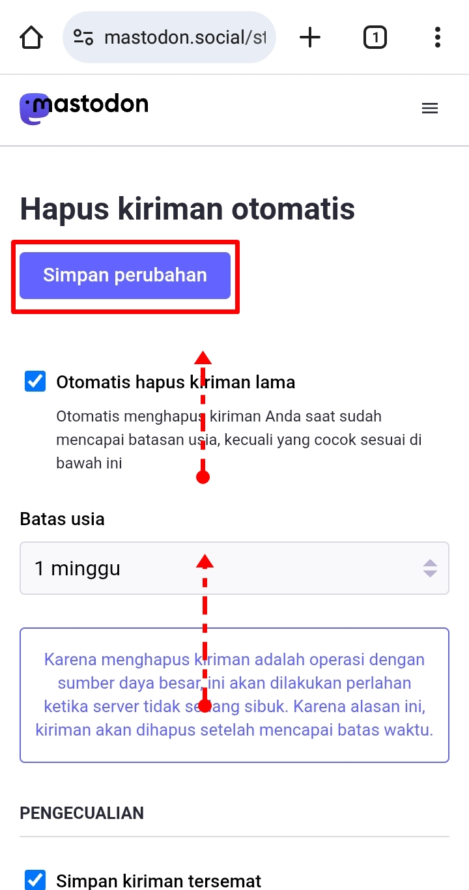

# Hapus Kiriman Otomatis (Automated Post Deletion)
Salah satu fitur di Mastodon untuk menambah privasi adalah fitur *hapus kiriman otomatis (automated post deletion)*. Setelah dalam jangka waktu yang kita tentukan, maka postingan kita akan dihapus secara otomatis oleh sistem. kita bisa mengaktifkan fitur ini secara manual.

Di menu pengaturan, klik ikon menu di pojok kanan atas, lalu klik *Hapus kiriman otomatis (Automated post deletion)*.

  

    
    
  

Di sini kita bisa centang *Otomatis hapus kiriman lama (Automatically delete old posts)* untuk mengaktifkannya.

  

    
  

*Batas usia (Age threshold)*, kita bisa memilih jangka waktu postingan itu berada di profil kita sebelum dihapus sistem. Misal di sini *1 minggu (1 week)*, maka setelah seminggu kita posting, maka postingan itu akan dihapus oleh sistem.

  

    
    
  

Untuk penjelasan pilihan pengecualian (exceptions):
- ***Simpan kiriman tersemat (keep pinned posts)***. Postingan yang kita pin (pinned posts) di profil kita, akan dikecualikan dari penghapusan otomatis.
- ***Simpan pesan langsung (keep direct messages)***. Postingan yang kita buat dengan set privasi '*Private mention*' alias DM atau direct message, akan dikecualikan dari penghapusan otomatis.
- ***Simpan kiriman favorit anda (keep posts you favorited)***. Postingan yang kita like sendiri, akan dikecualikan dari penghapusan otomatis.
- ***Simpan kiriman yang anda markahi (keep posts you bookmarked)***. Postingan yang kita bookmark sendiri, akan dikecualikan dari penghapusan otomatis.
- ***Simpan japat (keep polls)***. Postingan yang memiliki polls, akan dikecualikan dari penghapusan otomatis.
- ***SImpan kiriman dengan lampiran media (keep posts with media attachments)***. Postingan yang memiliki media (gambar atau video), akan dikecualikan dari penghapusan otomatis.

  

    
  

Untuk penjelasan pilihan *pengecualian berdasarkan interaksi (exceptions based interactions)*:
- ***Simpan kiriman favorit lebih dari (Keep posts favorited at least)***. Kita bisa menentukan berapa jumlah like dalam sebuah postingan agar postingan tersebut bisa dikecualikan dari penghapusan otomatis.
- ***Simpan kiriman yang di-boost lebih dari (Keep posts boosted at least)***. Dan kita juga bisa menentukan berapa jumlah boost (atau repost atau retweet dalam istilah Twitter) dalam sebuah postingan agar postingan tersebut bisa dikecualikan dari penghapusan otomatis.

  

    
  

Jika sudah, scroll ke atas lalu klik ***Simpan Perubahan (Save changes)***.

  

    
  

