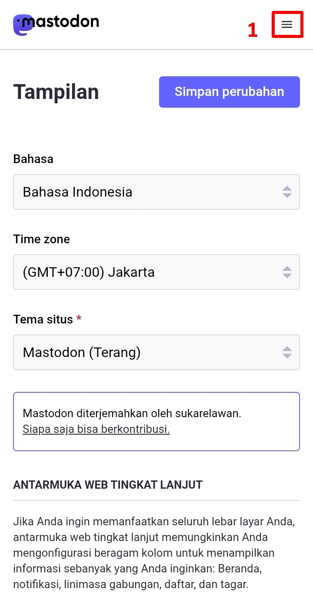
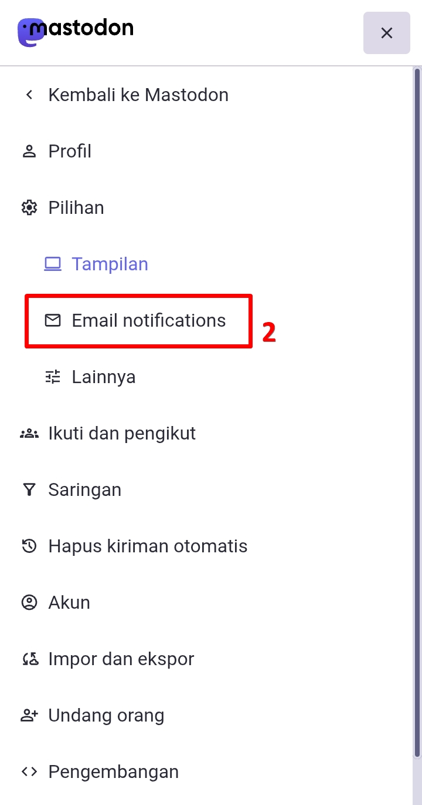
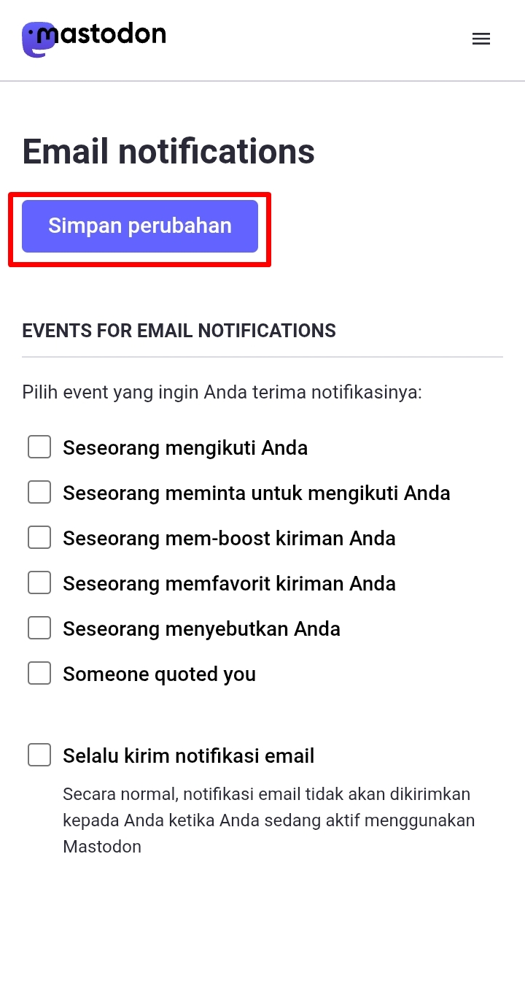

# Mengatur Notifikasi Surel (Opsional)
Kita mungkin agak sedikit terganggu, apabila Mastodon kerap mengirim pesan surel jika ada pengikut baru, ada yang boost postingan kita, dsb. Di bagian ini, kita bisa mematikan itu semua.

Di menu pengaturan, klik ikon menu di pojok kanan atas, lalu klik *Pilihan (Preferences)*, setelah itu klik ikon menu di pojok kanan atas lagi lalu klik *Email notifications*.

  

    
    
  

Di sini kita bisa matikan semuanya, lalu klik ***Simpan Perubahan (Save changes)***.

  

    
  

