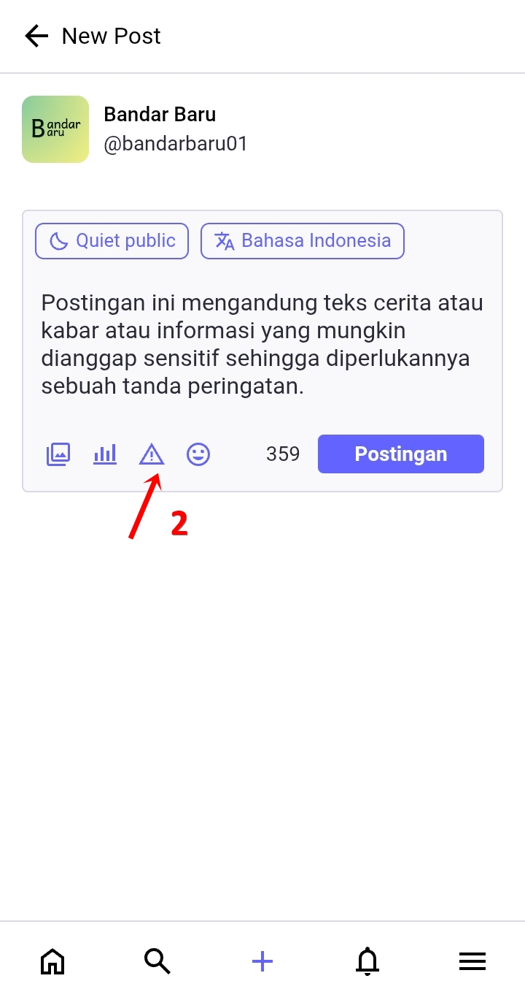
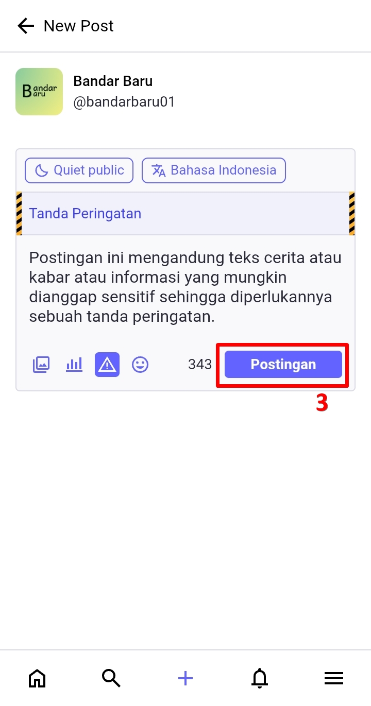
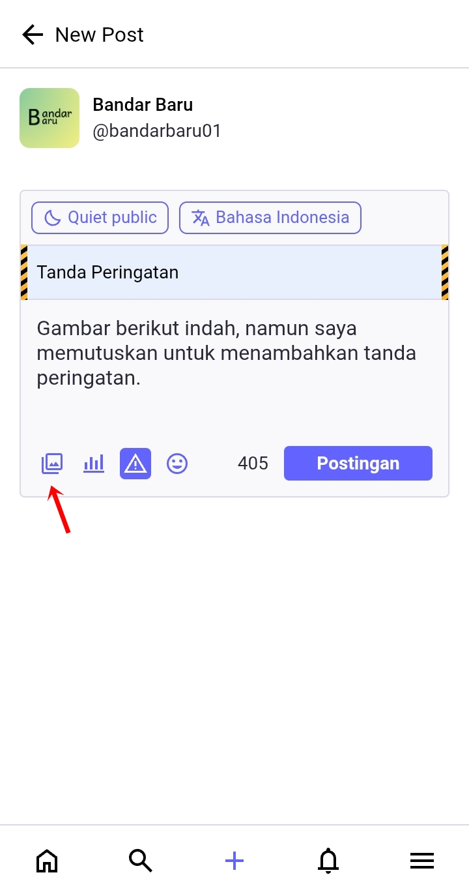
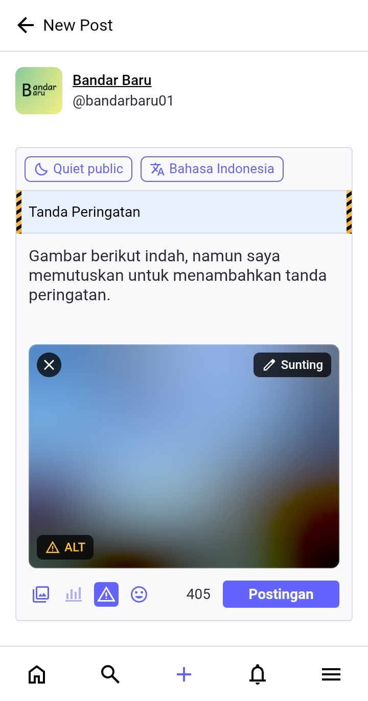
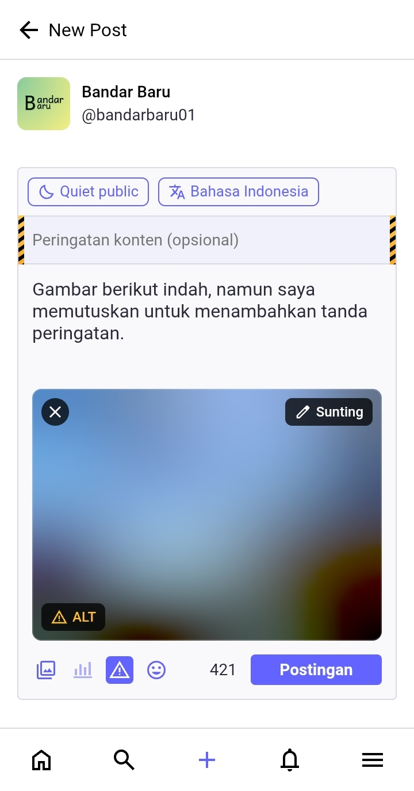

# Membuat Postingan Dengan Tanda Peringatan (Trigger Warning)
Baik, sekarang kita akan mempelajari bagaimana membuat postingan dengan tanda peringatan (atau trigger warning). Ini sangat berfungsi agar postingan dengan konten-konten sensitif dapat disembunyikan, tidak langsung tampil secara gamblang di hadapan pengguna lain yang tidak siap melihat konten-konten seperti itu.

Tidak cuma konten sensitif saja, tetapi kita bisa mengaplikasikan tanda peringatan ini ke seluruh jenis konten-konten yang kamu unggah yang dirasa sensitif bagi sebagian pengikut kita.

Mari kita buat postingan baru -> klik ikon tanda peringatan untuk menambahkan tanda peringatan pada postingan kita, lalu tulis bagaimana kita menjelaskan deskripsi singkat yang akan muncul sebelum pengguna lain mengklik dan membaca seluruh isi postingan kita. Bila sudah, klik *Postingan (Post)*, dan postingan kita sudah memiliki tanda peringatan, di mana isi postingan kita disembunyikan dan kita mesti mengklik *Show more* untuk melihat isi postingan tersebut.

  

    
    
    
    
    
  

Kita juga bisa lengkapi dengan media (gambar/video). Unggah media dengan mengkilk ikon gambar. Gambar yang terposting dengan tanda peringatan secara bawaan di-blur dan kita mesti mengklik *Click to show* untuk melihatnya.

  

    
    
    
    
  

Bila kamu tidak mengisi deskripsi singkat, maka teks tidak akan disembunyikan namun gambar akan di-blur.

  

    
    
  

