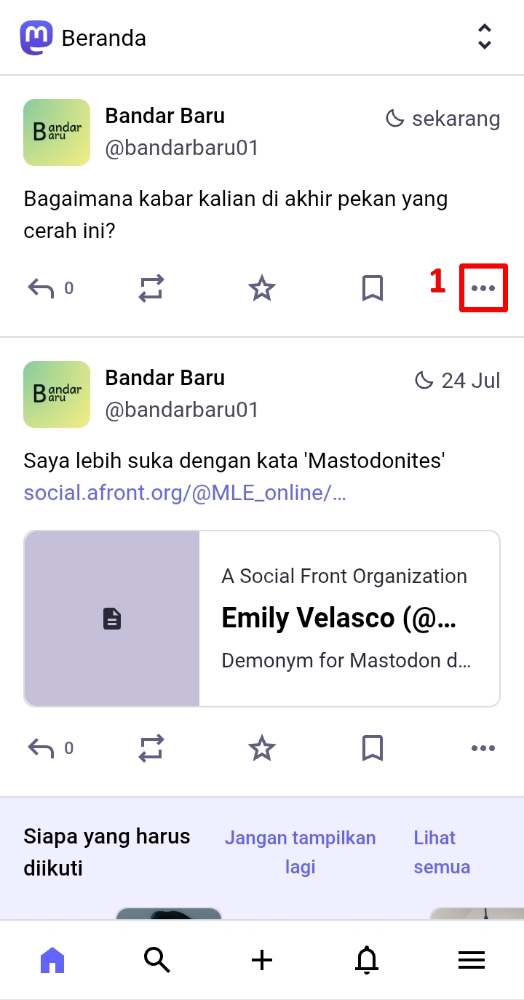
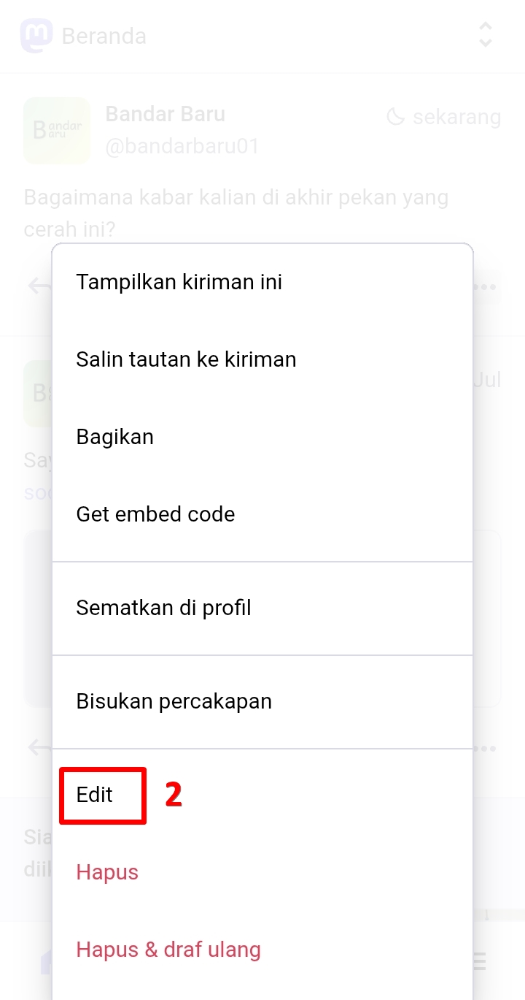
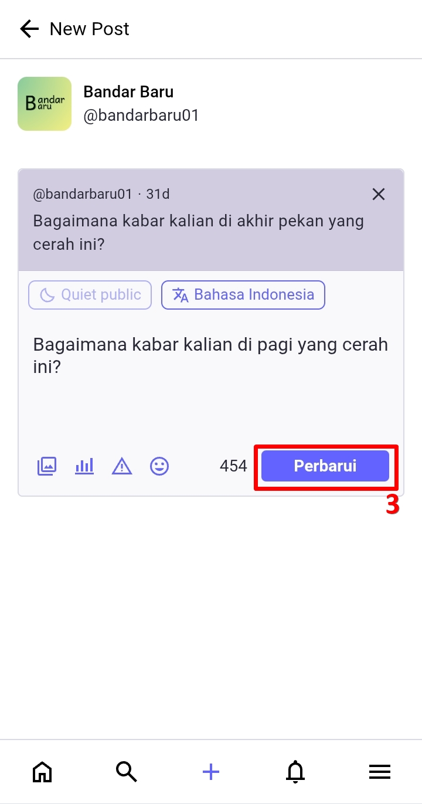
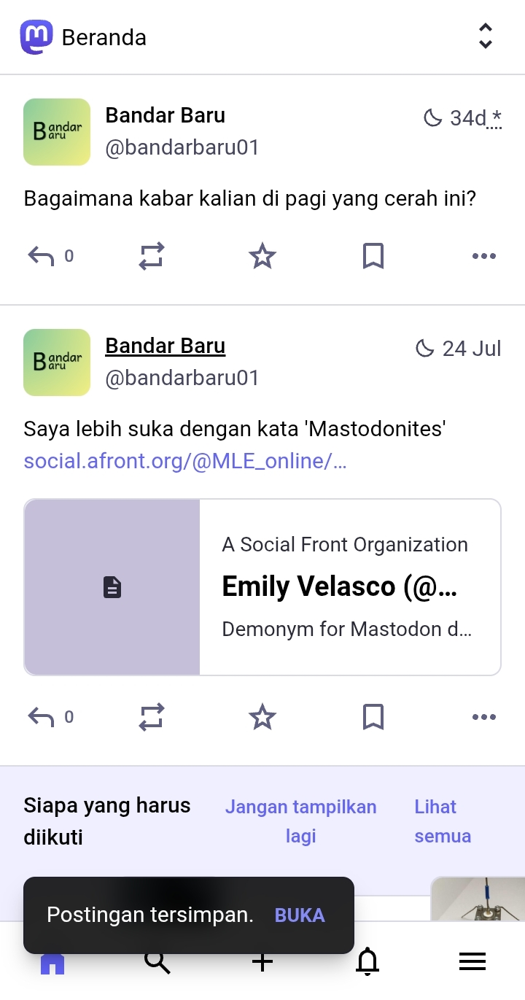
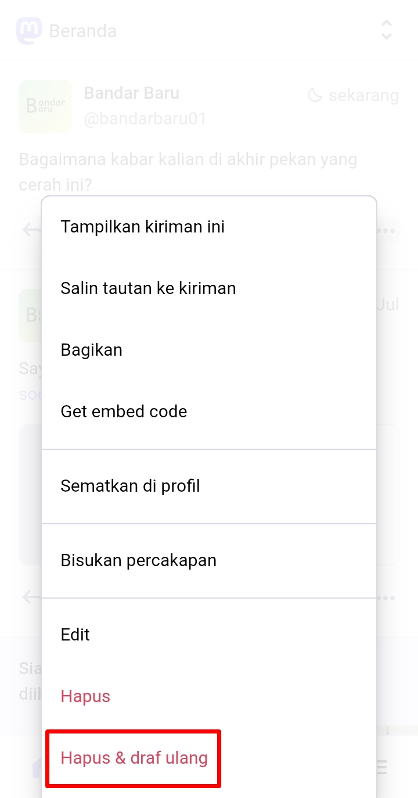
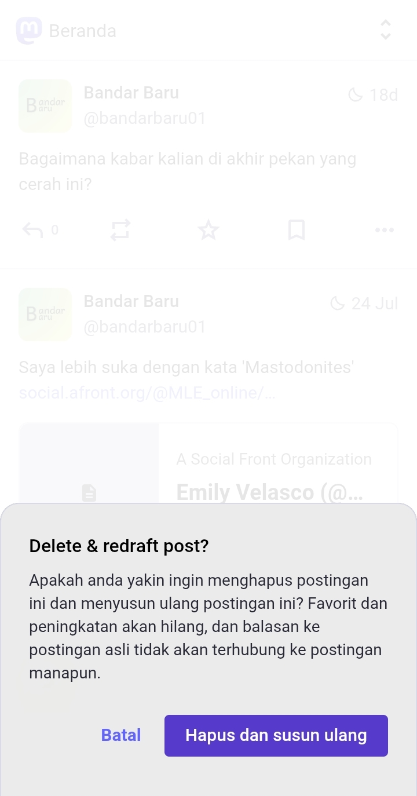
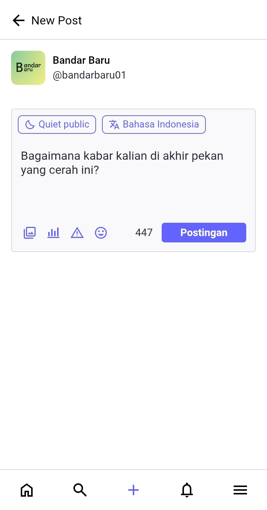

# Mengubah Isi Postingan
Salah satu fitur di Mastodon adalah, kita bisa mengubah isi postingan yang sudah terposting. Mari melihat postingan yang telah terposting.

Klik ikon menu pada sebuah postingan, lalu klik *Edit*.

  

    
    
  

Di sini kita bisa mengubah isi postingan. Jika sudah, klik ***Perbarui (Update)***.

  

    
    
  

Namun ada satu cara lagi. Yakni *Hapus dan draf ulang (delete & re-draft)*. Postingan akan terhapus, namun otomatis kita akan diarahkan untuk menulisnya kembali.

  

    
    
    
  

Mengingat nature Mastodon yang terdesentralisasi, terkadang jika kita mengubah postingan kita, perubahan itu mungkin tidak akan langsung direfleksikan di peladen-peladen yang lain, terutama bila peladen tsb. menggunakan sistem yang berbeda dari Mastodon.

Kapan sebaiknya menggunakan *edit*? Saat perubahan postingan itu terlalu minim, hanya memperbaiki typo, dan juga postingan tersebut sudah di-like atau di-boost (repost atau retweet dalam istilah Twitter).

Kapan sebaiknya menggunakan *hapus dan draf ulang (delete & re-draft)*? Saat perubahan postingan itu terlalu signifikan, memperbaiki tatanan kata, dan juga postingan tersebut belum di-like atau di-boost (repost atau retweet dalam istilah Twitter) sama sekali oleh pengguna lain.

