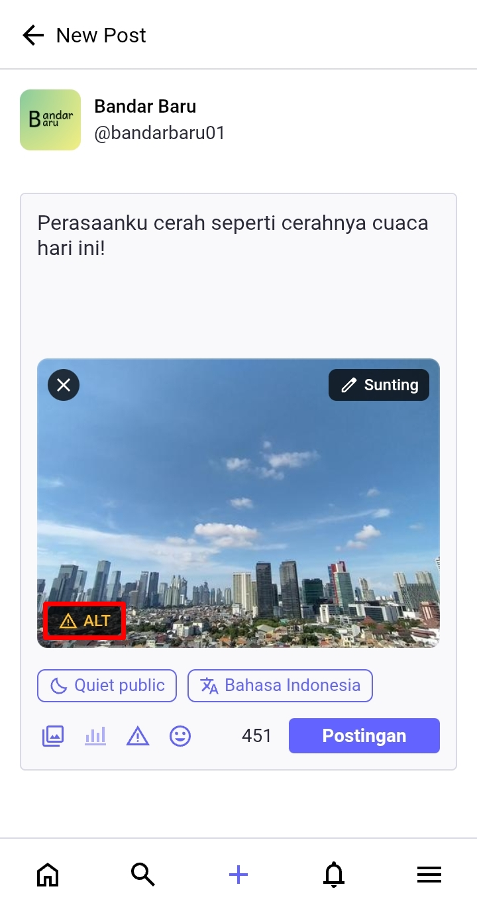
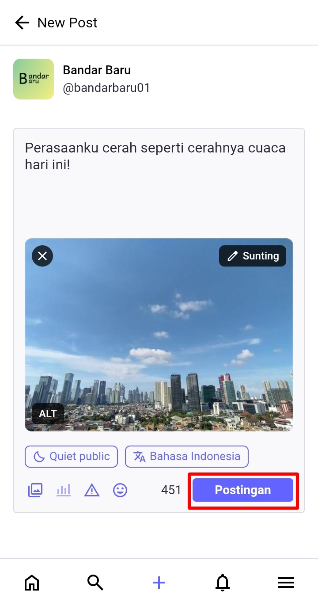
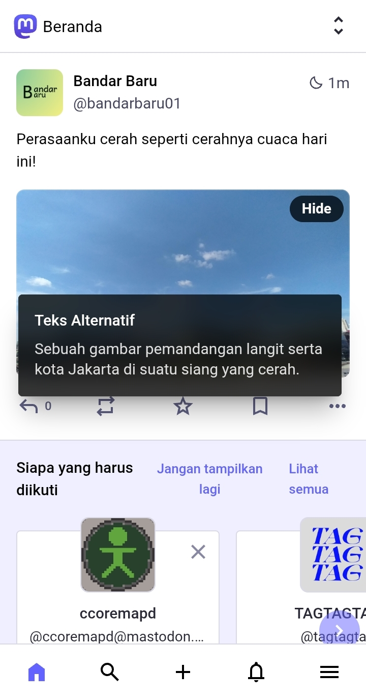
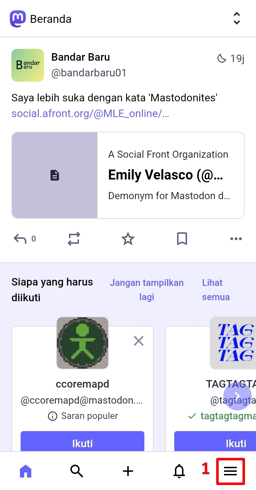

# Menambahkan Teks Alternatif (ALT Text)
Salah satu fitur lainnya adalah menambahkan teks alternatif (ALT Text). Apa itu teks alternatif (ALT Text)? Sederhananya adalah teks yang menemani gambar tersebut, untuk menjelaskan lebih detail ada apa pada gambar tersebut. Penggunaan teks ALT sangatlah didorong di Mastodon, untuk membantu pengguna yang memiliki gangguan pengelihatan untuk memahami isi dari gambar yang kita unggah.

Buat postingan baru dengan mengunggah sebuah gambar -> klik pada indikator 'ALT', lalu masukkan deskripsi-nya -> klik *Done* dan ***Postingan (Post)*** untuk memposting gambar tersebut.

  

    
    
    
    
  

Dan inilah dia. Setelah gambar itu kita posting, ada indikator ALT di bagian kanan bawah gambar, yang jika di-klik indikator tersebut, berisi deskripsi mengenai gambar tersebut.

  

    
    
  

> Bagaimana cara menulis teks ALT yang baik dapat [dicari](https://www.google.com/search?q=how+to+write+alt+text&udm=14) di internet, maupun dapat disimak pada [tautan berikut](https://accessibility.huit.harvard.edu/describe-content-images) (dalam Bahasa Inggris).

---

Catatan: Secara bawaan, Mastodon akan menampilkan pesan peringatan jika kita tidak menambahkan teks alternatif saat memposting gambar.

  

    
  

Jika kita memilih untuk tidak menggunakan teks ALT, dan ingin menghapus pesan seperti ini, sebelum memposting gambar tanpa teks ALT, kita bisa klik panel menu -> klik *Pengaturan (Settings)* -> scroll ke bawah -> matikan centang *Show confirmation dialog before posting media without alt text* -> lalu klik ***Simpan perubahan (Save changes)***.

  

    
    
    
  

