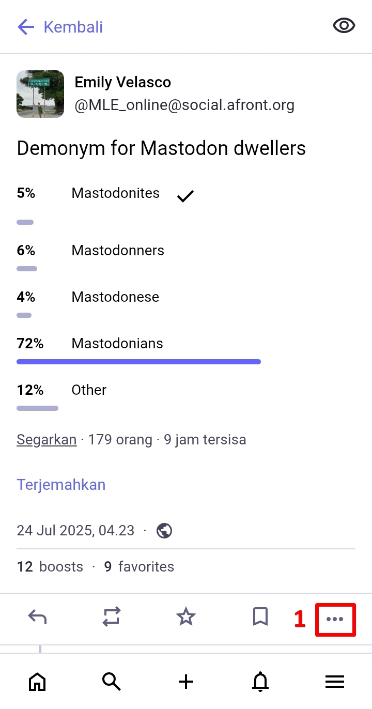
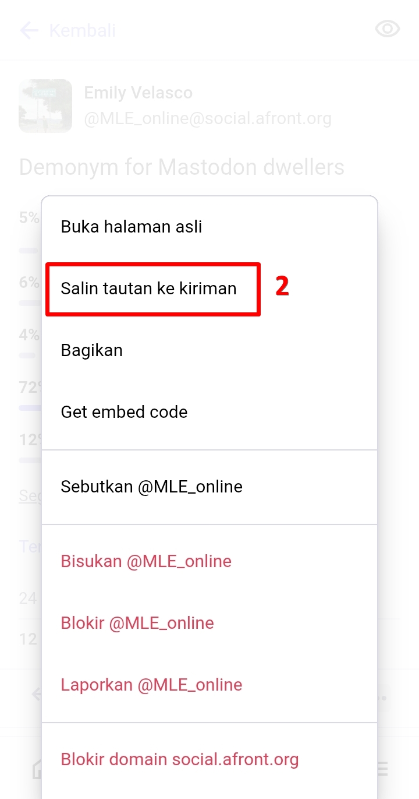
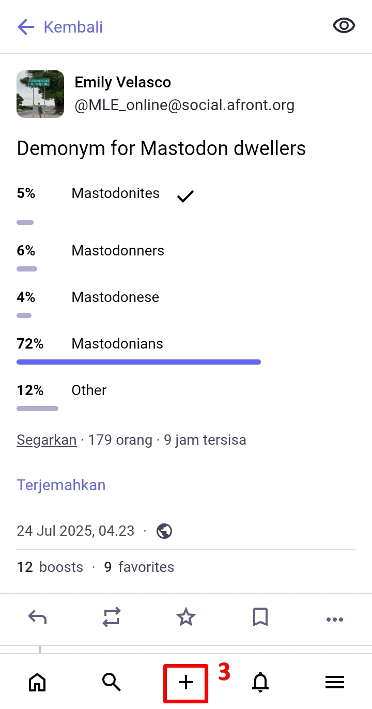
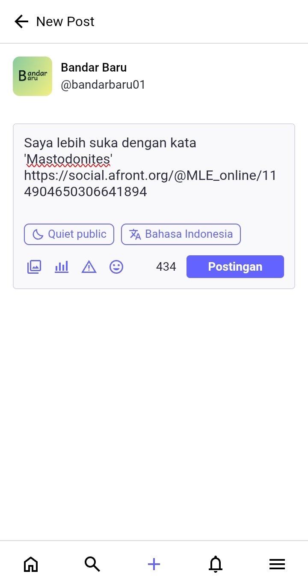
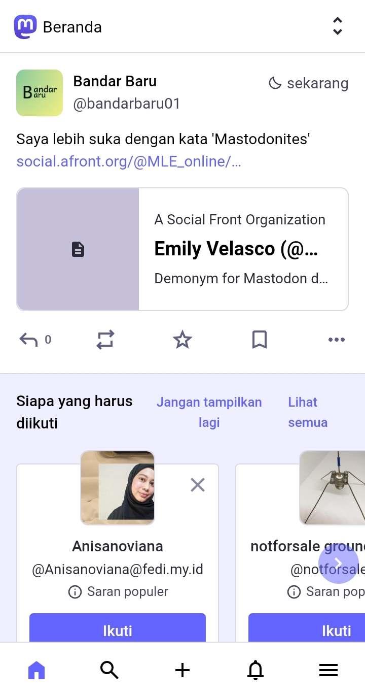
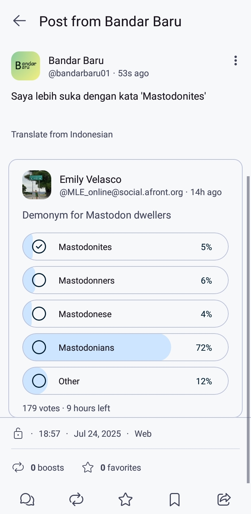

# Mengutip Postingan Pengguna Lain (Quote Repost)
Mungkin kamu bingung, bagaimana untuk mengutip postingan pengguna lain (quote repost atau quote retweet (QRT) dalam istilah Twitter)?

Untuk saat ini, pengguna menggunakan cara tradisional untuk mengutip postingan orang lain. Misalnya, kamu ingin quote repost postingan berikut. Maka di bagian bawah postingan, klik titik tiga di pojok kanan bawah, klik *salin tautan ke kiriman (copy link to post)*. Maka, otomatis tautan postingan tersebut akan tersalin ke clipboard kita.

  

    
    
  

Kemudian kita buat post baru, tempel (atau klik paste) di kolom postingan, kemudian tinggal tambahkan narasi sesuai keinginan kita, lalu klik *Terbitkan (post)*.

  

    
    
  

Maka, postingannya akan tampil seperti ini.

  

    
  

Seperti tidak terlihat ya isi postingan yang di-quote post?

Jangan khawatir! Karena di aplikasi pihak ke-tiga misalnya, postingan tsb. akan terrender sesuai dengan masing-masing aplikasi.

  

    
  

