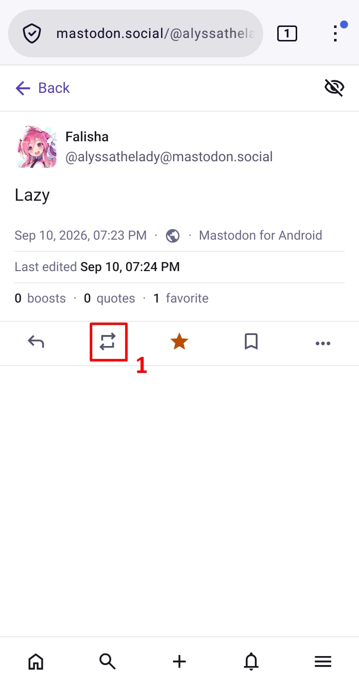
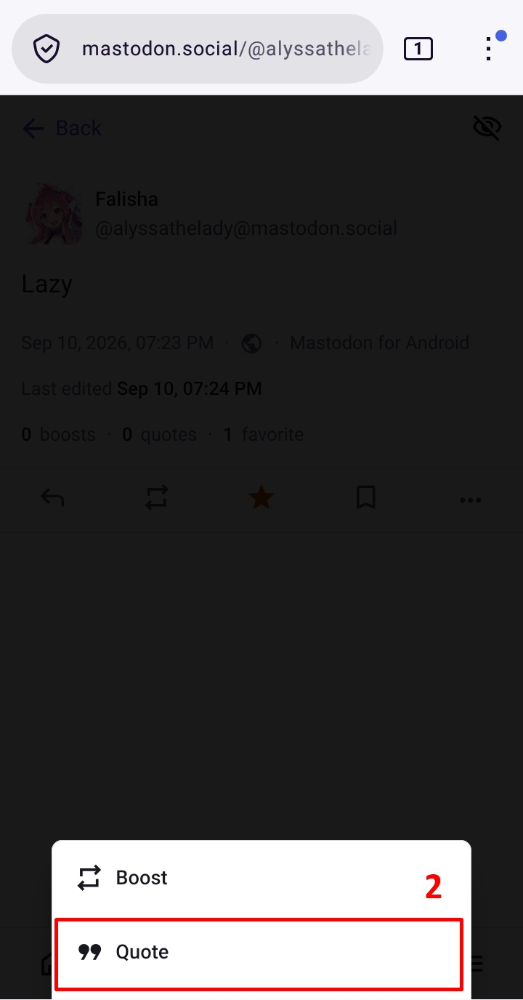
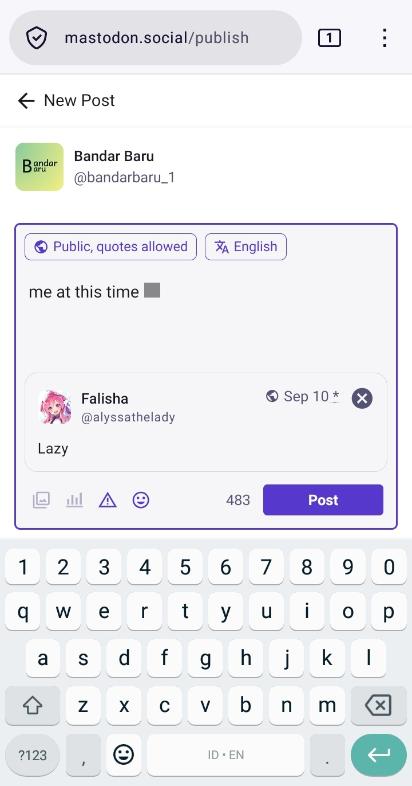
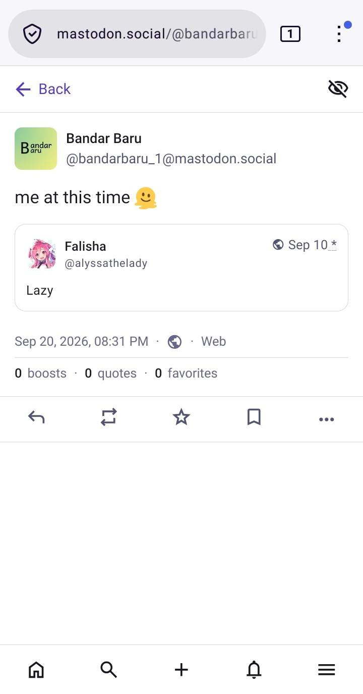
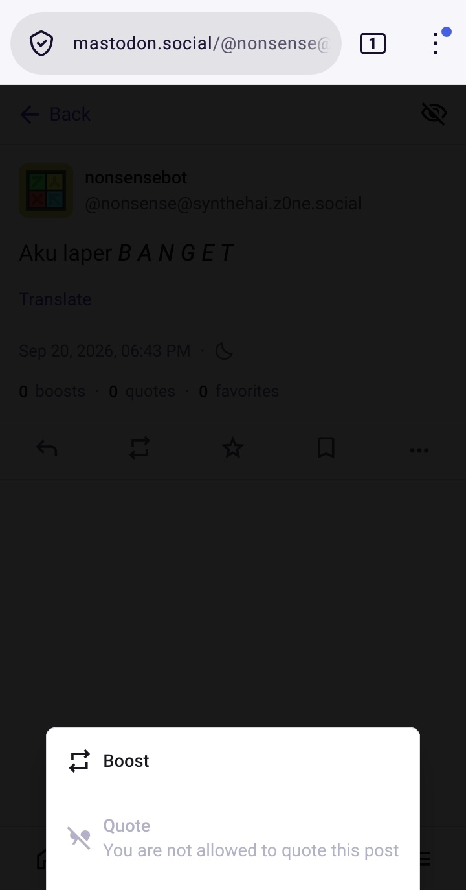
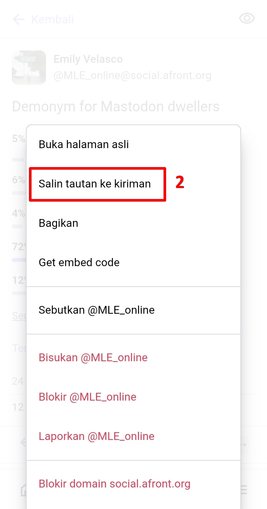
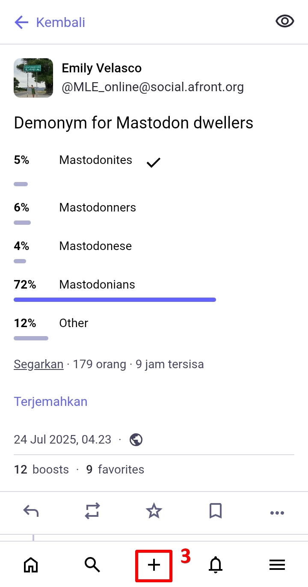
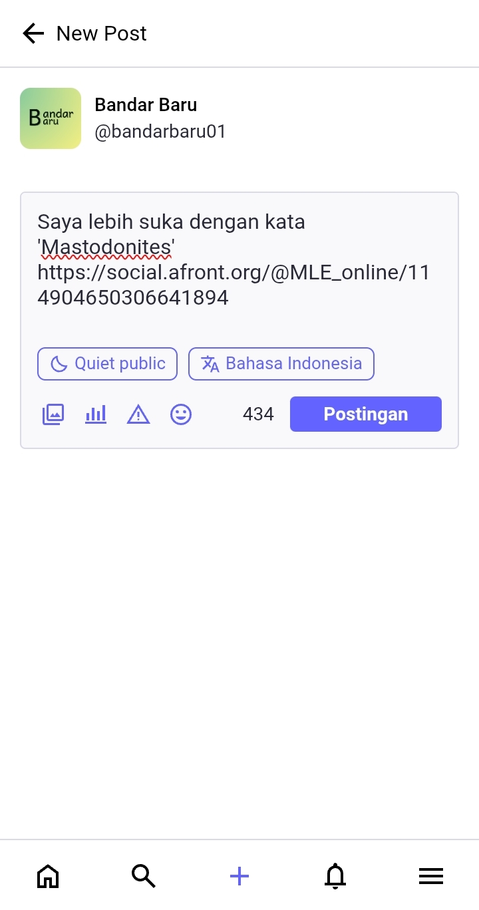
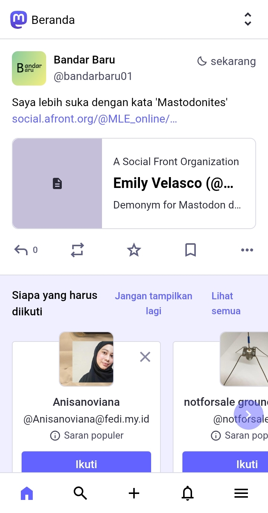
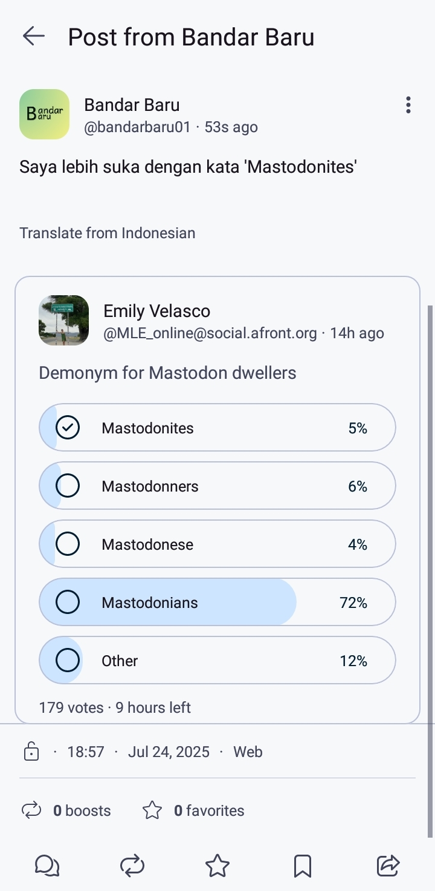

# Mengutip Postingan Pengguna Lain (Quote Repost)

Kita bisa mengutip postingan orang lain sembari ikut di-repost (quote repost) dengan cara berikut:

Klik tombol *Repost*, lalu klik *Quote*.

  

    
    
  

Kemudian cukup kita menambahkan isi narasi sesuai keinginan kita, lalu klik *Post*.

  

    
  

Maka, postingannya akan tampil seperti ini.

  

    
  

Ada kalanya, sebuah postingan tidak dapat di-quote. Biasanya ini terjadi apabila postingan tersebut berasal dari peladen non-Mastodon atau yang tidak didukung dengan fitur quote-posting Mastodon secara native.

  

    
  

Maka kita bisa melakukan quote posting dengan cara manual. Misalnya, kita ingin quote repost postingan berikut. Maka di bagian bawah postingan, klik titik tiga di pojok kanan bawah, klik *salin tautan ke kiriman (copy link to post)*. Maka, otomatis tautan postingan tersebut akan tersalin ke clipboard kita.

  

    
    
  

Kemudian kita buat post baru, tempel (atau klik paste) di kolom postingan, kemudian tinggal tambahkan narasi sesuai keinginan kita, lalu klik *Postingan (post)*.

  

    
    
  

Maka, postingannya akan tampil seperti ini.

  

    
  

Seperti tidak terlihat ya isi postingan yang di-quote post?

Jangan khawatir! Karena di aplikasi pihak ke-tiga misalnya, postingan tsb. akan terrender sesuai dengan masing-masing aplikasi.

  

    
  

