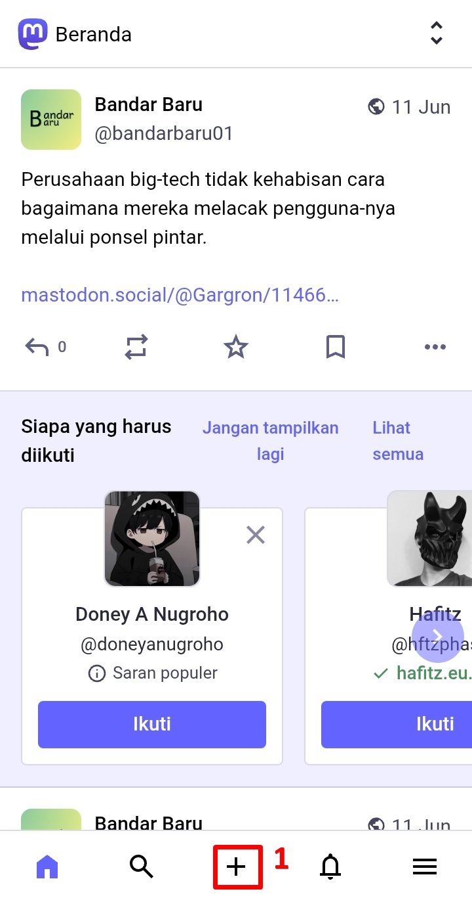
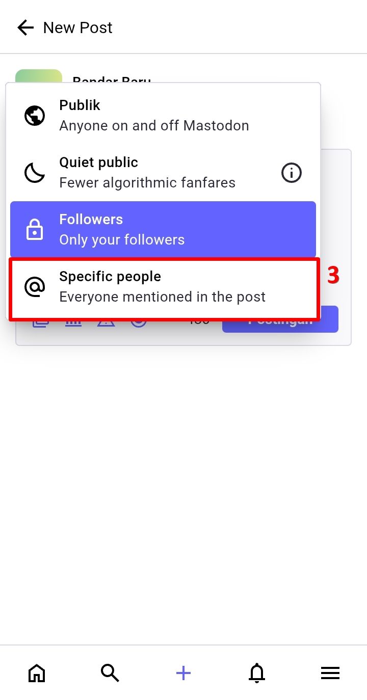
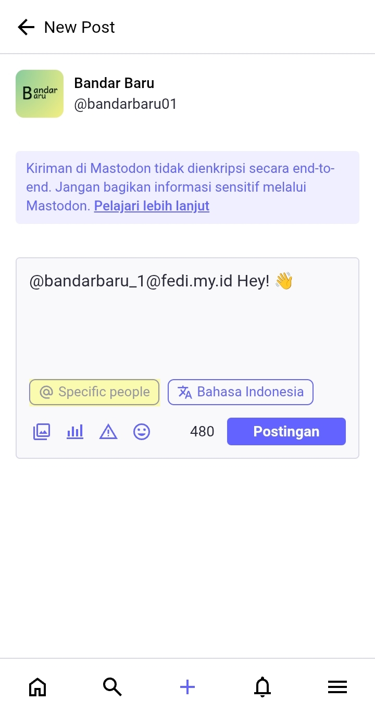
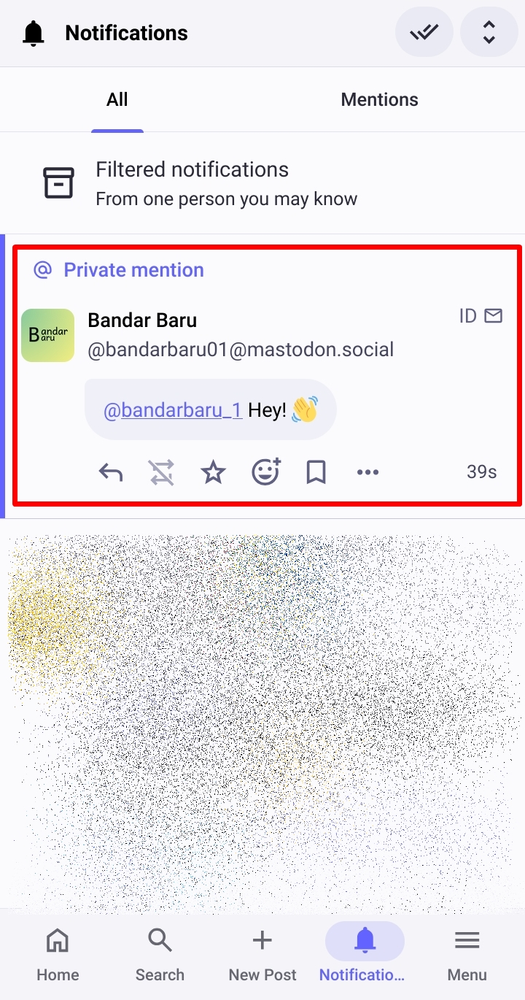
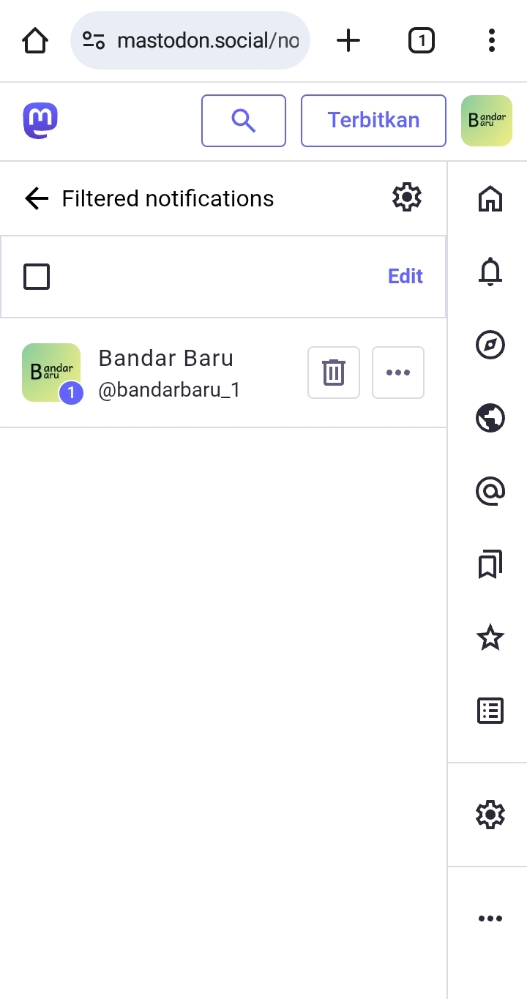

# Mengirim Pesan Pribadi (Direct Message)
Mungkin kamu bingung, bagaimana bisa mengirim DM atau Direct Message di Mastodon.

Mari kita buat postingan baru. Mention pengguna yang mau dikirimi DM (jika pengguna itu berada di satu peladen dengan kamu, maka yang ditampilkan cukup nama pengguna-nya saja: `@bandarbaru_1`, tetapi jika berbeda peladen maka yang ditampilkan lengkap bersama dengan nama peladennya: `@bandarbaru_1@fedi.my.id`, akun tersebut berada di peladen fedi.my.id). Set postingannya ke *private mention/specific people*, lalu kita klik *postingan (post)*.

  

    
    
    
    
    
  

Selamat, kamu sudah mengirim pesan DM ke pengguna lain! Postingan itu hanya bisa dibaca oleh orang yang kita mention saja. Postingan kita itu masuk ke notifikasi pengguna yang dituju.

  

    
  

Catatan tambahan:
1. Bila ada pengguna lain yang membalas postinganmu, atau mengirimmu DM tetapi kamu tida menerima notifikasi, buka halaman notifikasi, lalu klik *Notifikasi yang disaring (Filtered notifications)*. Klik tanda centang di atas untuk menerima-nya agar masuk ke notifikasi kita.

  

    
    
    
  

2. DM di Mastodon **tidaklah terenkripsi secara End-to-End**. Diupayakan untuk tidak mengirim pesan yang terlalu pribadi atau mengandung informasi pribadi atau sensitif melalui DM. Saya menyarankan untuk menggunakan aplikasi [Signal](https://signal.org/) [[Android](https://play.google.com/store/apps/details?id=org.thoughtcrime.securesms)] [[iOS](https://apps.apple.com/us/app/signal-private-messenger/id874139669)] yang memang didesain untuk percakapan 1-to-1 terenkripsi secara End-to-End.
