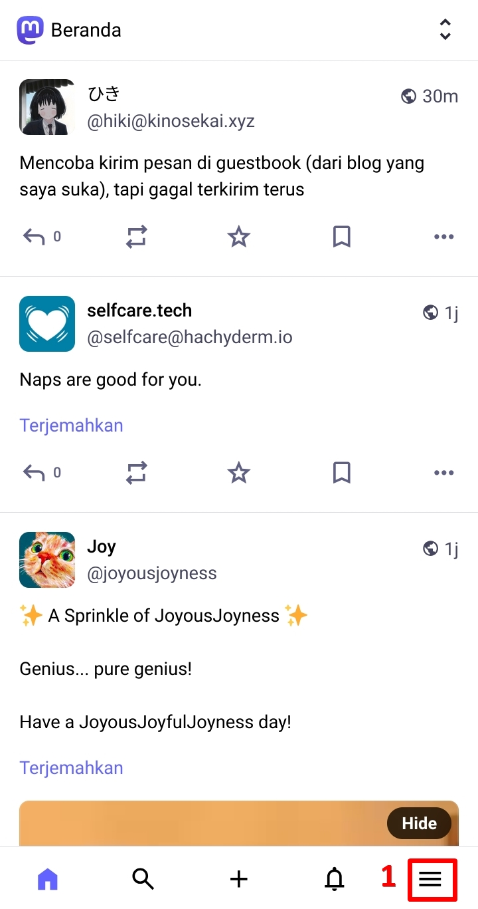
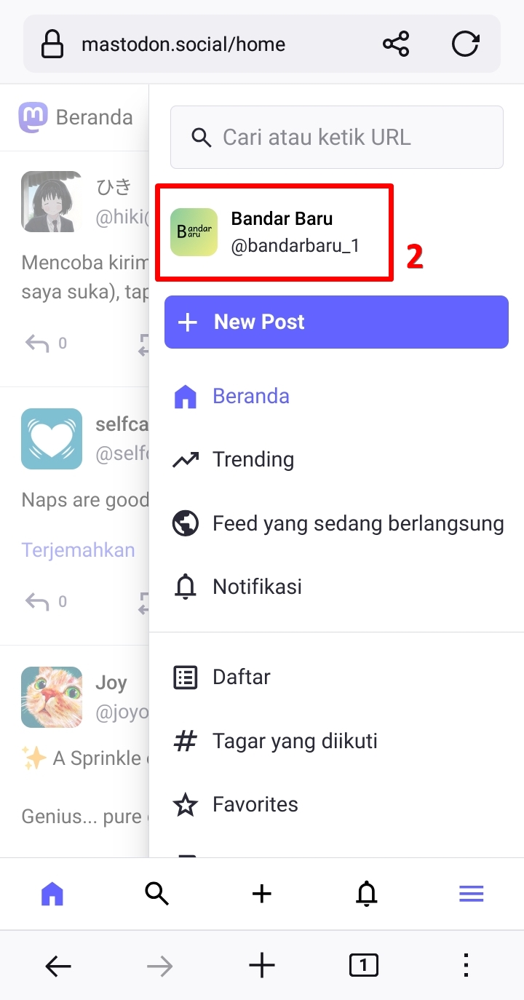
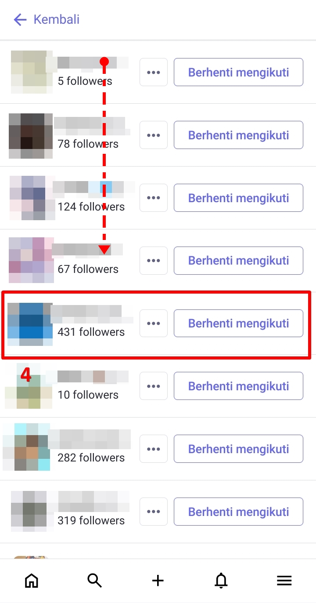
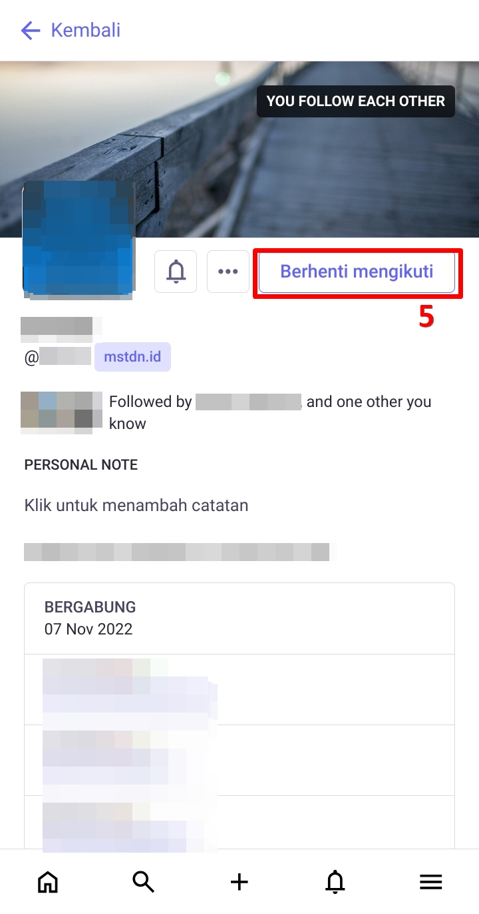
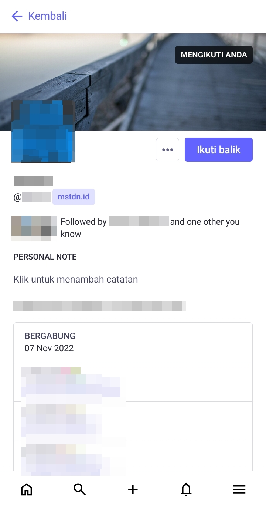
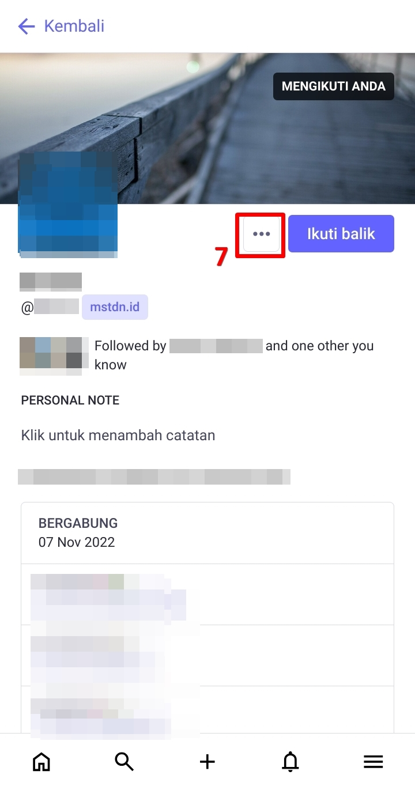
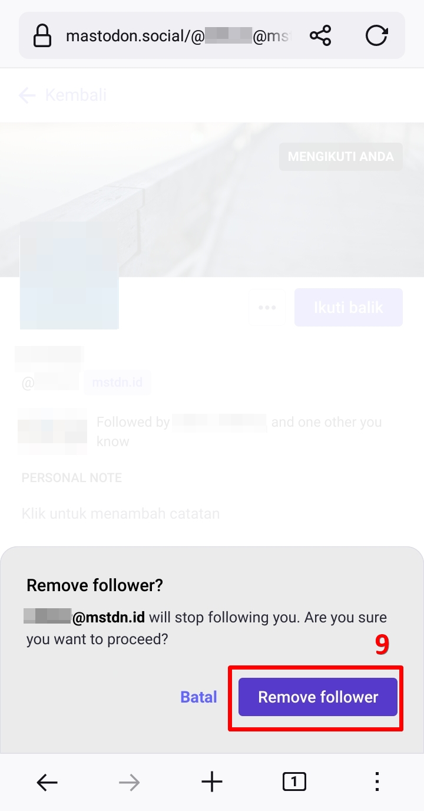
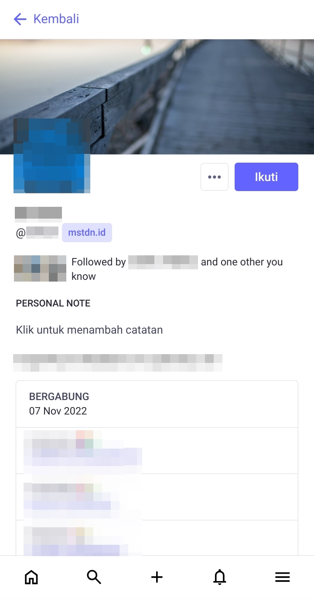

# Menghapus Mutual
Mungkin ada di satu titik, salah satu mutual berselisih dengan kita atau memiliki perasaan yang tidak enak dengannya, dan kita ingin unfollow dia. Biasanya kita cukup kilk *Berhenti Mengikuti (Unfollow)* dan selesai, kita tidak lagi mengikuti akun dia itu, namun jika sebelumnya dia sempat ber-mutual follow dengan kita, kita unfollow dia namun dia masih follow kita. Di sini kita bisa menghapus status mutual tersebut, di mana kita unfollow dia, dia juga unfollow kita, tanpa perlu klik *Blokir (Block)* dulu.

Mari kita ke halaman profil kita. Di halaman beranda, klik panel menu -> klik profil kita. Di halaman profil, kita klik daftar *Following* kita, mari kita scroll akun yang kita ingin unfollow. Setelah kita menemukan akun yang akan kita unfollow, kita klik ***Berhenti Mengikuti (Unfollow)***, dan selesai, kita tidak lagi mengikuti akun itu.

  

    
    
    
    
    
    
    
  

Perhatikan, sebelum kita klik *Berhenti Mengikuti (Unfollow)*, ada status bar di banner profil bahwa *You Follow Each Other*, yang berarti akun kita dengan akun tersebut saling mengikuti satu sama lain, alias mutual follow.

Setelah kita klik *Berhenti Mengikuti (Unfollow)*, status bar tersebut berubah menjadi *Mengikuti Anda (Follows You)*, yang berarti dia mengikuti kita, tetapi kita tidak mengikuti dia (tidak di-follow back).

Dari sini, kita klik ikon menu -> klik *Remove [username] from followers* -> ***Remove Follower***. Akun tersebut sudah tidak lagi mengikuti kita dan kita sudah tidak lagi bermutual dengan akun tersebut.

  

    
    
    
    
  

> Akun tersebut saya jadikan contoh untuk *berhenti mengikuti (unfollow)*, karena akun tersebut berada di peladen mstdn.id yang per tahun 2025 sudah tidak aktif, namun akunnya masih tersisa/tercatat di mastodon.social.

