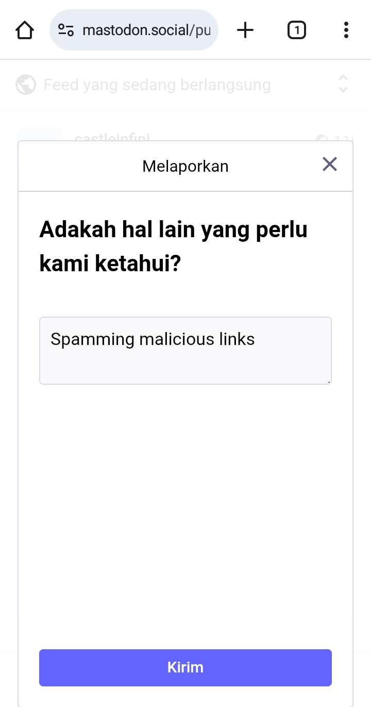

# Menjelajahi Linimasa Publik (Public Timeline), dan Bisukan & Blokir Akun
Baik di tulisan ini, kita akan mempelajari bagaimana menjelajahi linimasa publik di Mastodon.

Setidaknya di mastodon.social terdapat 2 linimasa publik: *Trending* & *Feed Yang Sedang Berlangsung/Linimasa Publik (Public Timeline)*.

  

    
    
  

*Trending* adalah linimasa yang berisi postingan-postingan yang sedang ramai di peladen tersebut, yakni di sini adalah mastodon.social. Bukan hanya dari pengguna mastodon.social saja, namun juga dari seluruh peladen yang terhubung dan berjejaring bersama mastodon.social akan tampil di sini.

  

    
  

Linimasa ini juga berisi sedikit permainan algoritma, di mana postingan-postingan yang di-like, di-boost (repost atau retweet dalam istilah Twitter) oleh orang yang kita ikuti juga akan tampil di sini.

Linimasa ini sangat didominasi oleh postingan-postingan luar negeri dan bahasa asing, mengingat ramainya pengguna mastodon.social dari luar negeri.

## Linimasa Publik

*Feed Yang Sedang Berlangsung/Linimasa Publik (Public Timeline)* adalah linimasi yang berisi postingan-postingan yang telah kita set aturannya di pengaturan, bahasa mana yang mau ditampilkan.

  

    
  

Terdapat 3 tab:
- ***Server Ini (This server)***. Postingan yang berasal dari peladen ini saja.
- ***Server Lain (Other servers)***. Postingan yang berasal dari peladen-peladen yang terhubung dengan mastodon.social, termasuk postingan dari [Threads (oleh Instagram)](https://github.com/bandarbaru-1/Panduan-Mastodon-Indonesia/blob/main/pages/21%20-%20Berinteraksi%20Dengan%20Pengguna%20Threads.md) dan juga [Bluesky (dari akun yang dijembatani)](https://github.com/bandarbaru-1/Panduan-Mastodon-Indonesia/blob/main/pages/22%20-%20Berinteraksi%20Dengan%20Pengguna%20Bluesky.md) akan muncul di sini.
- ***Semua (All)***. Menggabungkan keduanya.

> Jika linimasa publik masih menampilkan/didominasi oleh postingan berbahasa asing, kalian bisa kembali cek pengaturan bahasa untuk linimasa publik. Jika sudah sesuai pengaturannya, namun masih menampilkan postingan berbahasa asing, bisa dipastikan akun tersebut mengepost menggunakan setelan bahasa postingan yang salah. Agar tidak mempostingan dengan setelan bahasa yang salah, kita bisa setel pengaturan *Bahasa Posting*. Selengkapnya dijelaskan di [halaman berikut](https://github.com/bandarbaru-1/Panduan-Mastodon-Indonesia/blob/main/pages/05%20-%20Mengatur%20Aturan%20Postingan.md).

## Bisukan, Blokir, Laporkan Akun

Mengingat mastodon.social adalah peladen utama, sayangnya linimasa publik ini sudah dicemari oleh akun-akun bot yang tidak jelas. Nah sekarang kita akan bersihkan semuanya, masuklah kita ke bagian bisukan & blokir akun.

Pertama klik titik tiga di bagian bawah post, terserah, kita bisa ***Bisukan (Mute)***, ***Blokir (Blokir)***, dan ***Laporkan (Report)***.

  

    
    
  

#

Beberapa saran dari saya mengenai alur bisu-blokir-lapor):
1. Bila itu adalah akun berita recehan/SEO, akun jualan/promosi, akun bot, dsb. -> ***Bisukan (Mute)***

2. Bila itu adalah akun judol ->
- Jika akunnya berada di peladen yang sama denganmu-> ***Laporkan (Report)***
- Jika akunnya berada di peladen lain -> ***Blokir (Block)***

3. Bila itu adalah akun pornografi atau mengandung konten seksual yang menampilkan bagian sensitif manusia ->
- Bila posting tanpa tanda peringatan (dan berada di peladen yang sama denganmu) -> ***Laporkan (Report)***
- Bila posting tanpa tanda peringatan (dan berada di peladen lain) -> ***Blokir (Block)***
- Bila posting dengan tanda peringatan -> ***Biskukan (Mute)*** atau ***Blokir (Block)***

Dalam melaporkan akun-akun tersebut: kita bisa menggunakan bantuan layanan terjemahan daring (Google Translate, Bing Translator, dsb.) untuk menulis laporan kita ke admin atau moderator peladen.

  

    
  

Dalam membisukan akun, kita juga bisa klik *Show options*, dan pilih berapa durasi untuk membisukan akun tsb. dan juga memilih untuk tidak menyembunyikan notifikasi dari akun yang kita bisukan.

  

    
    
  

Namun jika kita overwhelm untuk memblokir satu per satu akun yang tidak jelas, maka saranku adalah untuk menghindari linimasa publik Bahasa Indonesia ini. Kita masih bisa mencari mutual dan postingan-postingan yang menarik melalui [akun-akun yang saya rekomendasikan di sini](https://github.com/bandarbaru-1/Panduan-Mastodon-Indonesia/blob/main/pages/20%20-%20Rekomendasi%20Akun%20Yang%20Dapat%20Diikuti.md).

