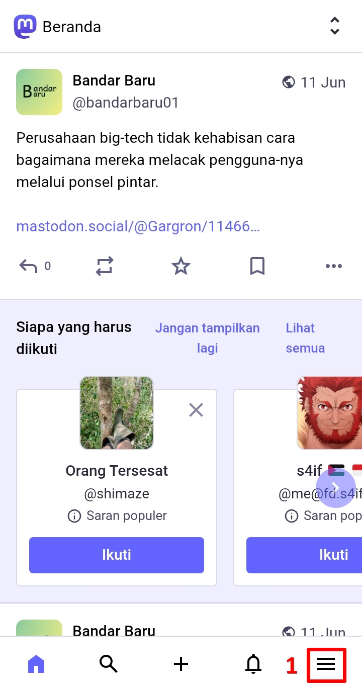
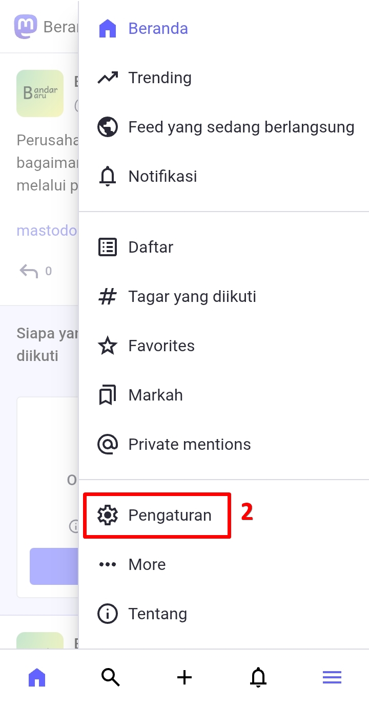
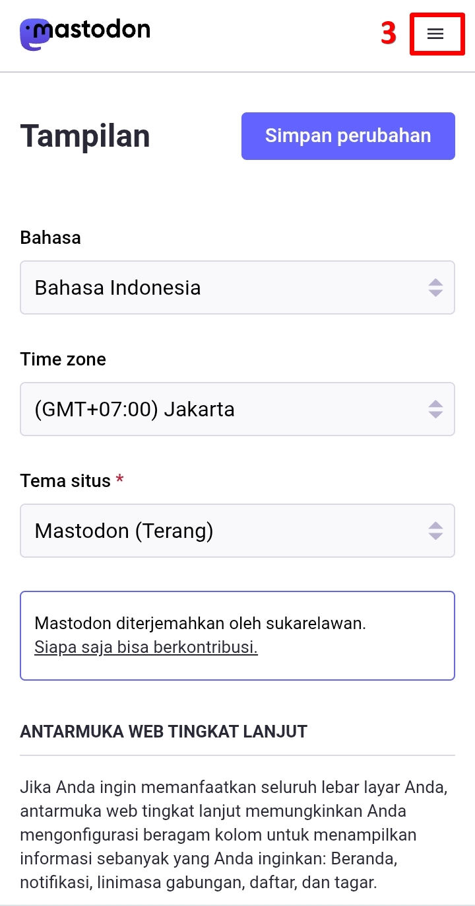
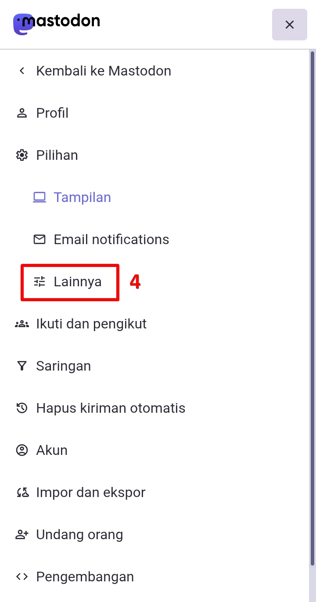
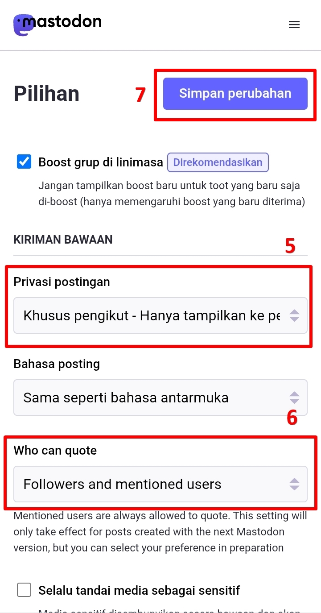
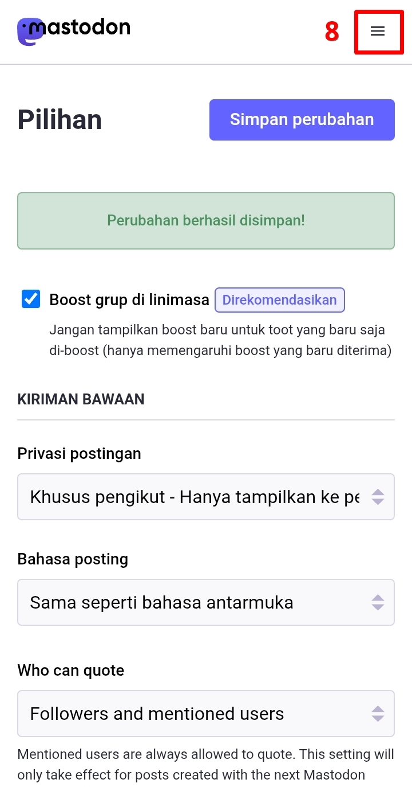
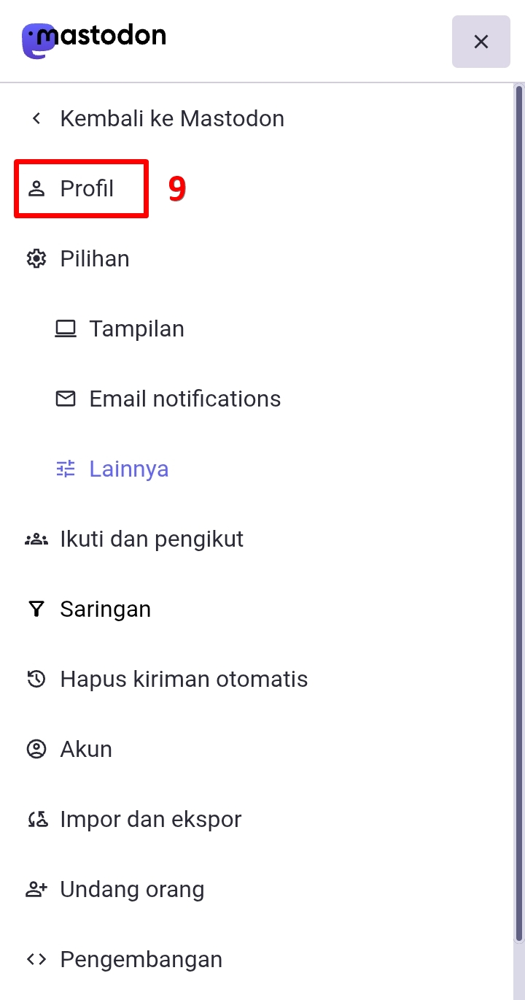
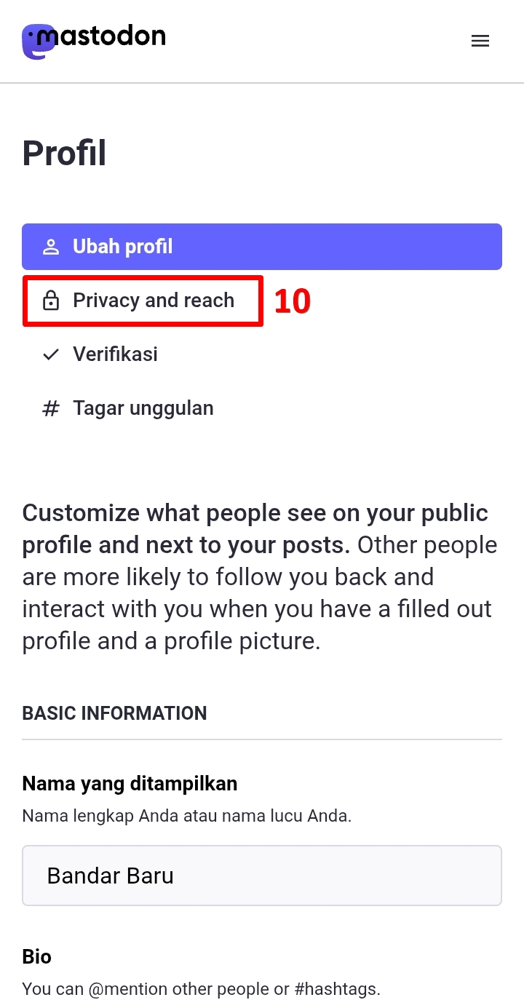
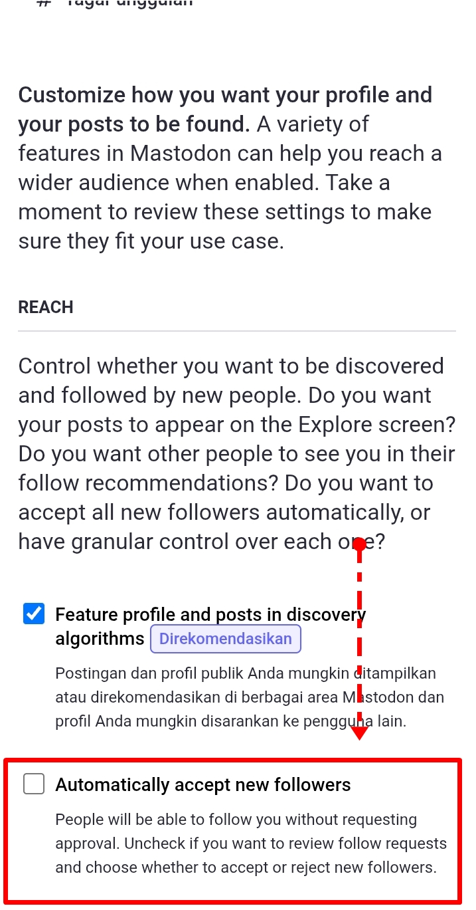
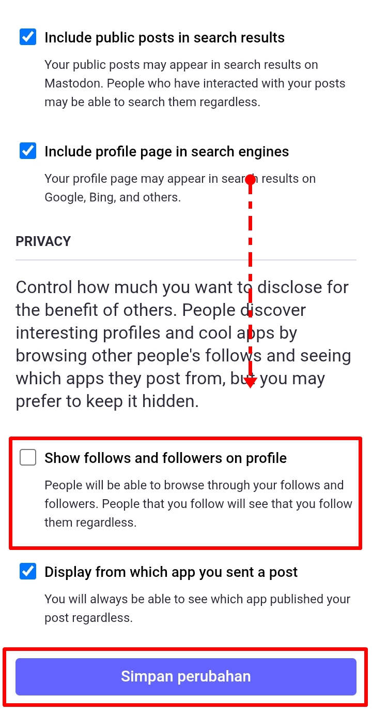

# Panduan Sederhana Akun Privat (Private Account)
Mungkin jika kalian overwhelm dengan panduan lengkap mengenai pengaturan yang telah saya [jelaskan sebelumnya](https://github.com/bandarbaru-1/Panduan-Mastodon-Indonesia/blob/main/pages/06%20-%20Mengatur%20Privasi%20Akun.md). Maka saya membuat bagian terpisah panduan sederhana agar akun kalian bisa sepenuhnya menjadi akun privat.

Di halaman beranda, klik panel menu -> klik *Pengaturan (Preferences)* -> di halaman berikutnya, klik panel menu -> klik *Lainnya (Other)*.

  

    
    
    
    
  

Di bagian *kiriman bawaan (posting defaults)*, *privasi postingan (posting privacy)* set ke ***Khusus pengikut - Hanya tampilkan ke pengikut (Followers only - Only show to followers)***, *who can quote* set ke ***Followers and mentioned users***, scroll ke bawah, klik ***Simpan perubahan (Save changes)***.

  

    
  

Dari sini, klik panel menu -> klik *Profil (Public profile)*, lalu klik *Privacy and reach*, scroll ke bawah, di bagian *reach*, **matikan centang *Automatically accept new followers***. Scroll ke bawah, di bagian *privacy*, **matikan centang *Show follows and followers on profile***, klik ***Simpan perubahan (Save changes)***.

  

    
    
    
    
    
  

Selesai, kini akun kita sudah menjadi akun privat. Postingan kita selanjutnya akan secara default ke-set setelan privasi-nya khusus pengikut kita saja, dan jika ada pengikut baru, maka kita perlu menyetujuinya terlebih dahulu. 

