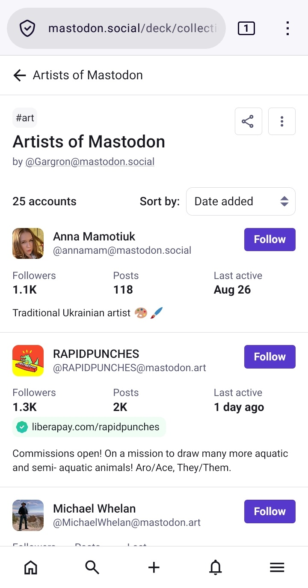
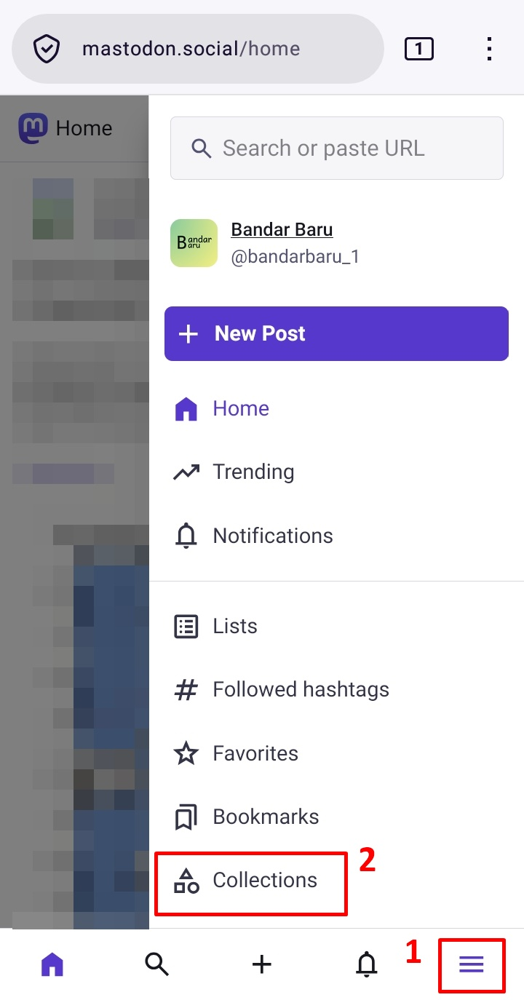
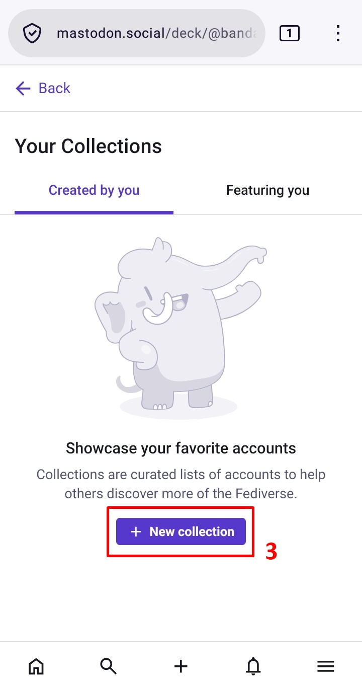
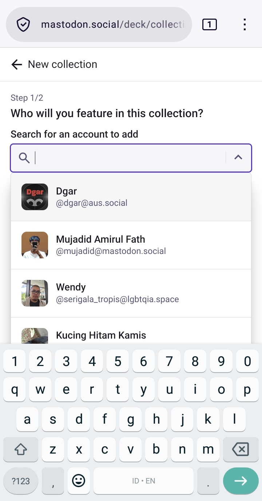
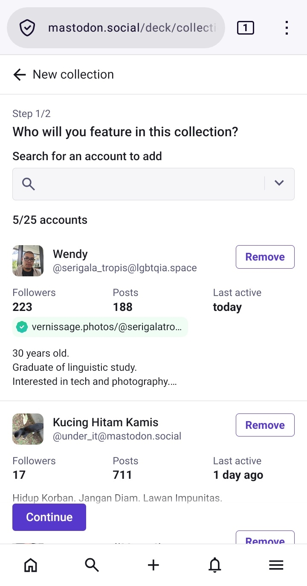
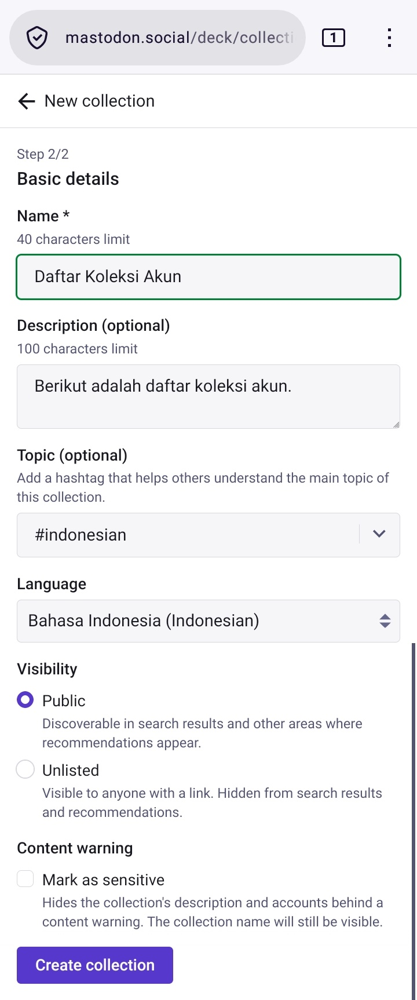

# Membuat Collections dan Rekomendasi Akun Yang Dapat Diikuti (Opsional)

Collections adalah sebuah fitur yang dapat menambahkan akun-akun yang kita kurasi (bisa itu akun yang menurut kalian menarik sesuai topik, atau bahkan mutualan circle kalian) yang dapat kita bagikan, serta pengguna lain bisa mengikuti daftar akun-akun yang kita kurasi tersebut.

Berikut adalah sebuah contoh daftar Collections yang disusun oleh Gargron, berisi kumpulan akun-akun seni yang berada di Mastodon yang beliau kurasikan.

  

    
  

[**Artists of Mastodon** by Gargron](https://mastodon.social/collections/116777306758391615)

Kita bisa membuat Collections sendiri, dengan mengklik bilah menu, lalu klik *Collections*.

  

    
  

Di sini, kita bisa membuat daftar akunnya dengan mengklik *New Collection*, mulai masukkan nama-nama akun yang mau ditambahkan. Ketika sudah selesai, klik *Continue* lalu kita bisa menambahkan judul daftar collections, serta deskripsinya, topic hashtag, bahasa, visibilitas daftar (public atau unlist), kemudian content warning bila daftar tersebut memuat muatan yang sensitif.

Selesai, klik *Create Collection*

  

    
    
    
    
  

#

Tentu, fitur Collections masih jauh dari kesempurnaan, seperti kita tidak bisa menambahkan akun yang mematikan [discoverability-nya](https://github.com/bandarbaru-1/Panduan-Mastodon-Indonesia/blob/main/pages/06%20-%20Mengatur%20Privasi%20Akun.md), serta akun-akun yang berada di peladen non-Mastodon, seperti Misskey, GTS, dsb.

Maka, berikut ini adalah kumpulan akun yang saya sendiri kumpulkan, kurasi, dan rekomendasikan untuk diikuti. Beberapa kumpulan akun berikut Berbahasa Indonesia (beberapa diantaranya juga campur dan/atau didominasi dengan Bahasa Inggris), memiliki interaksi organik, postingan yang menarik, dan bisa mempelajari perspektif yang baru dalam memandang kehidupan.

Silahkan salin-tempel (copy-paste) nama-nama pengguna berikut di bar pencarian Mastodon (atau klik **↗** untuk langsung menuju ke profil bila akun kalian berada di peladen mastodon.social):
- `@Mastodon@mastodon.social` (Akun resmi lembaga Mastodon GmbH) [↗](https://mastodon.social/@Mastodon)
- `@Gargron@mastodon.social` (Pendiri Mastodon) [↗](https://mastodon.social/@Gargron)
- `@sandycorzeta@misskey.id` (Pengelola peladen misskey.id) [↗](https://mastodon.social/@sandycorzeta@misskey.id)
- `@kimiamania@pegelinux.top` (Pengelola peladen fedi.my.id) [↗](https://mastodon.social/@kimiamania@pegelinux.top)
- `@bandarbaru_1@mastodon.social` [↗](https://mastodon.social/@bandarbaru_1)
- `@testeraphy@fedi.my.id` [↗](https://mastodon.social/@testeraphy@fedi.my.id)
- `@hiki@fedi.nocojima.xyz` [↗](https://mastodon.social/@hiki@fedi.nocojima.xyz)
- `@LLENN08@misskey.id` [↗](https://mastodon.social/@LLENN08@misskey.id)
- `@alyssathelady@mastodon.social` [↗](https://mastodon.social/@alyssathelady)
- `@mebeforeyou01@mastodon.social` [↗](https://mastodon.social/@mebeforeyou01)
- `@yoursaturn@fedi.my.id` [↗](https://mastodon.social/@yoursaturn@fedi.my.id)
- `@solune_@mastodon.social` [↗](https://mastodon.social/@solune_)
- `@linerly@mstdn.plus` [↗](https://mastodon.social/@linerly@mstdn.plus)
- `@rieaglenest@blorbo.social` [↗](https://mastodon.social/@rieaglenest@blorbo.social)
- `@rdnmz@sharkey.world` [↗](https://mastodon.social/@rdnmz@sharkey.world)
- `@kekavigi@mas.to` [↗](https://mastodon.social/@kekavigi@mas.to)
- `@BlackyCats@misskey.id` [↗](https://mastodon.social/@BlackyCats@misskey.id)
- `@crse2100@misskey.design` [↗](https://mastodon.social/@crse2100@misskey.design)
- `@qa_tester@chara.social` [↗](https://mastodon.social/@qa_tester@chara.social)
- `@aku@anakmanis.com` [↗](https://mastodon.social/@aku@anakmanis.com)
- `@gombang@social.nancengka.com` [↗](https://mastodon.social/@gombang@social.nancengka.com)
- `@ivan_achlaqullah@ohai.social` [↗](https://mastodon.social/@ivan_achlaqullah@ohai.social)
- `@domswp@misskey.id` [↗](https://mastodon.social/@domswp@misskey.id)
- `@ccoremapd@fedi.my.id` [↗](https://mastodon.social/@ccoremapd@fedi.my.id)
- `@62ch_@misskey.id` [↗](https://mastodon.social/@62ch_@misskey.id)
- `@ufal@misskey.id` [↗](https://mastodon.social/@ufal@misskey.id)
- `@aulia@mementomori.social` [↗](https://mastodon.social/@aulia@mementomori.social)
- `@drahardja@sfba.social` [↗](https://mastodon.social/@drahardja@sfba.social)
- `@meutiafaradilla@mas.to` [↗](https://mastodon.social/@meutiafaradilla@mas.to)

> Kalian tidak perlu mengikuti semuanya, secukupnya saja. Tetapi jika ingin linimasa beranda kalian tetap ramai, terutama untuk yang baru saja bergabung di Mastodon, saya sarankan untuk mengikuti semuanya.

> Saya telah menyiapkan sebuah 'issue' di repositori ini sebagai daftar tambahan. Bila kalian: berasal dari Indonesia, memiliki interaksi organik, postingan yang menarik, dan bisa mempelajari perspektif yang baru dalam memandang kehidupan, kalian bisa menambahkannya sendiri melalui [halaman berikut](https://github.com/bandarbaru-1/Panduan-Mastodon-Indonesia/issues/1) (diperlukan akun GitHub untuk menambahkannya).

