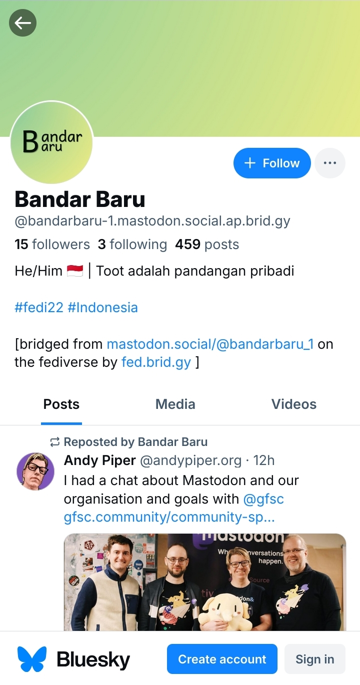

# Berinteraksi Dengan Pengguna Bluesky (Opsional)

Walaupun Mastodon dan Bluesky berbeda platform, namun kedua platform ini dapat saling terhubung melalui 'jembatan' yang dibangun oleh komunitas.

Kalian bisa mengaktifkan 'jembatan' itu melalui website: https://fed.brid.gy/login -> klik Mastodon -> ketik alamat peladen (dalam contoh di sini: mastodon.social) lalu klik tombol berikutnya -> [bila diminta untuk authorize, klik ***authorize***] -> dan selesai, semestinya akun kalian sudah terjembatani.

  

    
  

Kalian bisa klik tautan Bluesky untuk melihat akun Mastodon kalian terlihat di Bluesky.

  

    
    
  

Akun-akun yang berasal dari Bluesky akan memiliki akhiran @[nama pengguna]@**bsky.brid.gy**.

Namun bagaimana jika pengguna Bluesky yang kita cari dan ingin kita ikuti tidak terlihat di Mastodon? Pastikan pengguna tersebut juga sudah menjembatani akun mereka di Bluesky. Cukup berikan mereka [tautan ini](https://fed.brid.gy/login) dan biarkan mereka masuk menggunakan akun Bluesky mereka, agar akun mereka dapat juga tampil di Mastodon.

Informasi selengkapnya, dapat di baca di [halaman berikut](https://fed.brid.gy/docs) (dalam Bahasa Inggris).

