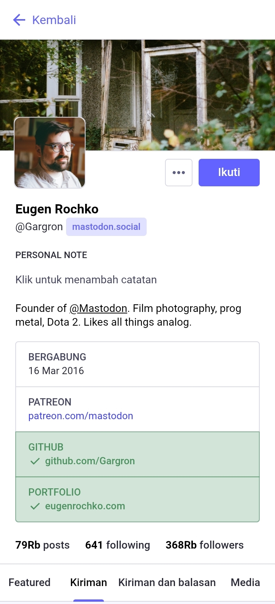
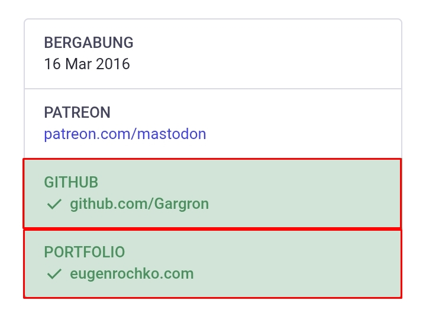
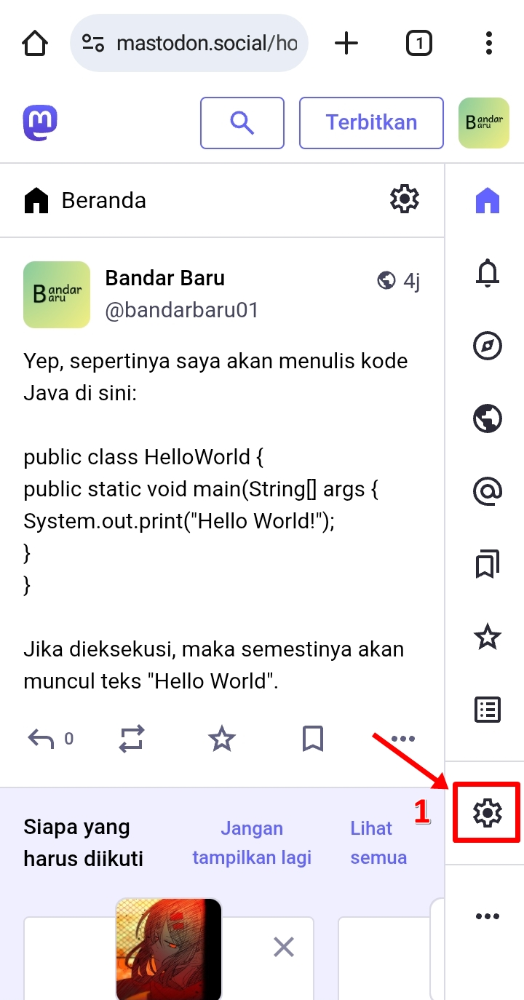
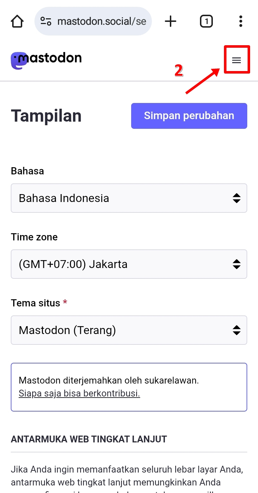
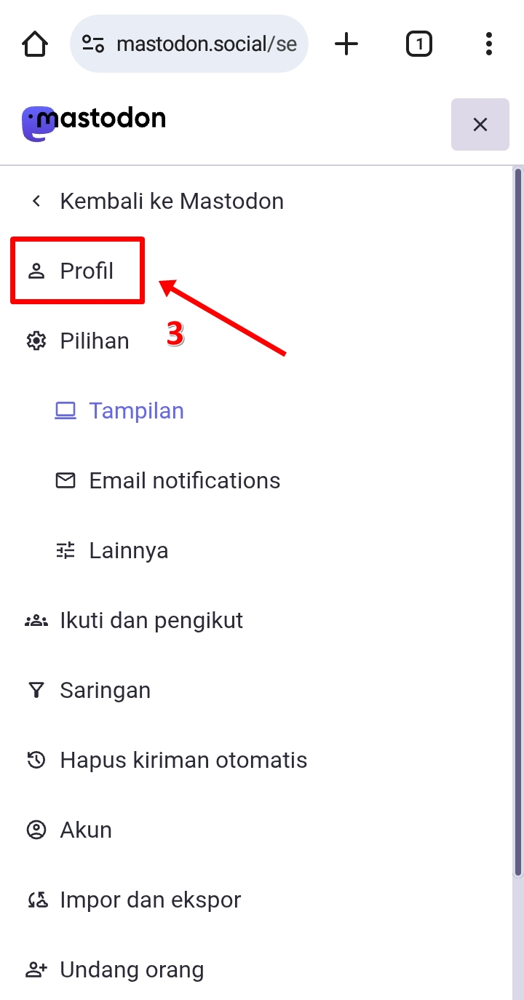
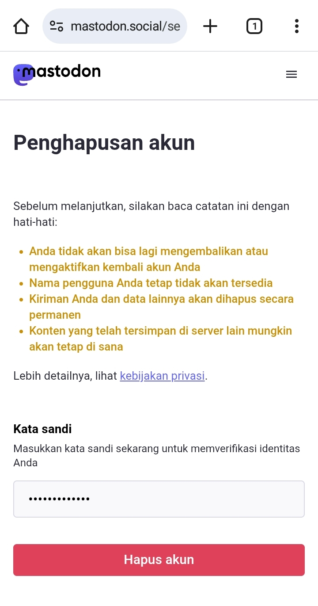

# Migrasi Akun dan Tutup Akun
Adakalanya sebuah peladen Mastodon mengumumkan untuk berhenti beroperasi, sedangkan kamu sudah membangun suatu basis pengikut yang cukup lumayan.

Jika terjadi demikian, mungkin kamu bisa berpikir untuk **pindah dan buat akun ke peladen Mastodon lain yang masih aktif dan kembali membangun basis pengikut di sana**. Dan cara ini adalah **cara yang termudah**.

**Ini juga mengapa saya masih merekomendasikan untuk bergabung di peladen utama yang besar, terutama yang langsung dikelola oleh lembaga utama seperti mastodon.social**, karena adanya jaminan keberlangsungan keberadaan peladen oleh lembaga utama tsb.

Peladen yang dikelola oleh komunitas misalnya, pada satu titik jika terjadi kendala (misal kendala teknis, pembiayaan, krisis moderator, dsb.), seringkali mereka memutuskan untuk menutup peladen yang mereka kelola.

Namun ini juga bukan berarti bahwa peladen mastodon.social juga tidak akan mengalami hal yang sama juga.

Baik, kembali ke pembahasan migrasi akun: Tetapi ada cara lain. Alih-alih membangun basis pengikut lagi di peladen baru, mengapa tidak basis pengikutmu yang sudah ada juga ikut pindah ke peladen baru?

Sayangnya, cara ini masih terlalu teknis bagi teman-teman. Maka jika teman-teman memilih untuk menggunakan cara ini (dengan catatan, teman-teman mesti dengan cara kerjanya yang kompleks dan siap dengan resiko gagal), penjelesan mengenai ini, akan saya referensikan teman-teman untuk membaca panduan berikut:

https://fedi.tips/transferring-your-mastodon-account-to-another-server/ (dalam Bahasa Inggris, atau dalam terjemahan ke dalam [Bahasa Indonesia](https://fedi-tips.translate.goog/transferring-your-mastodon-account-to-another-server/?_x_tr_sl=en&_x_tr_tl=id&_x_tr_hl=en-US))

#

Atau mungkin, teman-teman berpikir untuk hapus akun? Mungkin teman-teman merasa ada defiensi dan mempertimbangkan hal-hal lain untuk meninggalkan dan berhenti menggunakan Mastodon. Daripada meninggalkan Mastodon dengan masih meninggalkan postingan atau gambar yang dapat menjadi masalah privasi bagi kalian di masa mendatang, lebih baik teman-teman menghapus akun sebelum meninggalkan dan berhenti menggunakan Mastodon.

Baik, di beranda, klik ikon pengaturan -> klik menu -> klik *Akun (Account)* -> *scroll* ke bawah, di bagian *Hapus akun (Delete account)*, klik ***memproses ini (proceed here)***.

Perhatikan catatannya: akun yang telah dihapus tidak dapat diaktifkan kembali, nama pengguna kamu tidak dapat lagi digunakan ketika kamu mendaftar kembali, seluruh data kamu di Mastodon terhapus, namun data kamu mungkin masih tersimpan di peladen lain (terutama jika peladen itu menggunakan sistem yang berbeda dari Mastodon).

Jika sudah, masukkan kata sandi, dan klik ***Hapus akun (Delete account)***.

Selesai. Semoga bisa bertemu lagi di lain waktu dan di lain kesempatan.