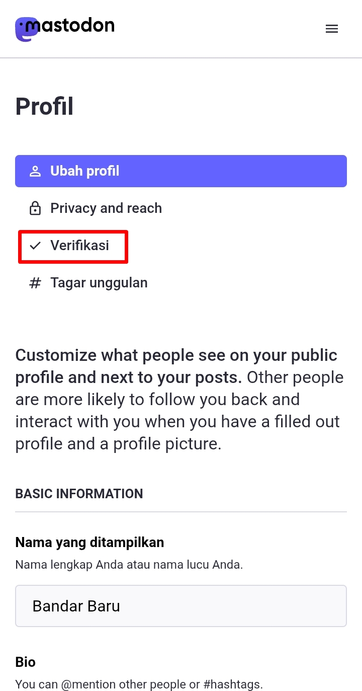

# Tautan di Bio dan Verifikasi Akun

Mastodon memiliki pendekatan yang berbeda mengenai verifikasi akun. Tidak seperti di Twitter, di mana pengguna dapat mendapatkan tanda centang biru yang didapatkan dari Twitter atau dengan membayar langganan Twitter Blue.

Mastodon tidak seperti itu. Bahkan akun resmi Eugene Rochko (pendiri & pencipta Mastodon) juga tidak memiliki tanda centang biru atau yang menunjukkan tanda verifikasi di samping namanya.

  

    
  

Namun, jika kita melihat akun beliau, tepat di bagian tautan di bio beliau terdapat indikator berwarna hijau.

  

    
  

Ini menunjukkan bahwa pada tautan tersebut, beliau memasukkan beberapa potongan kode agar tautan tersebut mendapat indikator centang hijau pada halaman profilnya. Bila kita menambahkan tautan, namun tidak menambahkan potongan kode tsb., maka tidak ada indikator centang hijau pada tautan tersebut.

Bagaimana menemukan potongan kode tsb.?

Mari kita ke beranda, klik panel menu -> klik *Pengaturan (Preferences)* -> di halaman berikutnya, klik panel menu -> pilih *Profil (Public profile)* -> scroll ke bawah, kita akan menemukan kolom *Metadata profil (Extra fields)*.

  

    
    
    
    
    
  

Kamu bisa masukkan *label*-nya adalah: "Blog", "Website", atau apapun itu. Lalu *konten (content)*-nya adalah alamat website yang kita miliki. **Alamat website mesti diawali** **`https://`**, karena jika tidak, maka website tsb. tidak akan ditampilkan sebagai tautan yang dapat diklik.

Jika sudah, scroll ke bawah, lalu klik *Simpan perubahan (Save changes)*.

  

    
  

#

Setelah kita memasukkan tautan kita di bio, dan ingin memberikan verifikasi agar tautan tersebut terdapat indikator berwarna hijau. Di halaman pengaturan *Profil (Public Profile)*, klik *Verifikasi (Verification)*.

  

    
  

Scroll bawah sedikit, nah di sini kita akan menemukan potongan kode yang kamu dapat tempelkan ke kode sumber website-mu atau blog-mu.

  

    
  

Jika sudah, mungkin tunggu berapa saat dan coba refresh halaman profil-mu, semestinya tautan tersebut berubah menjadi warna hijau.

  

    
  

Bingung bagaimana memasukkan potongan kode tersebut? Jika kamu memiliki website di mana kamu bisa memodifikasi kode sumber-nya, kamu bisa langsung memasukkan potongan kode tersebut di kode sumber website-mu.

Bila kamu menggunakan layanan blog seperti Wordpress & Blogger, kamu bisa memasukkan potongan kode tersebut dengan menambahkan sebuah widget.

**Terlalu teknis? Tenang saja.** Kita bisa menggunakan metode tradisional.

Jika kamu sebelumnya punya basis pengikut di platform sosial media lain, kamu bisa katakan kepada pengikutmu di sana bahwa kamu membuat akun di Mastodon dengan menunjukkan nama penggunamu di Mastodon. Dengan begini, maka ini juga bisa membuktikan bahwa kepemilikan akunmu di Mastodon adalah asli, dimiliki sendiri. Bukan atas *impersonation* atau pemalsuan identitas orang lain.
