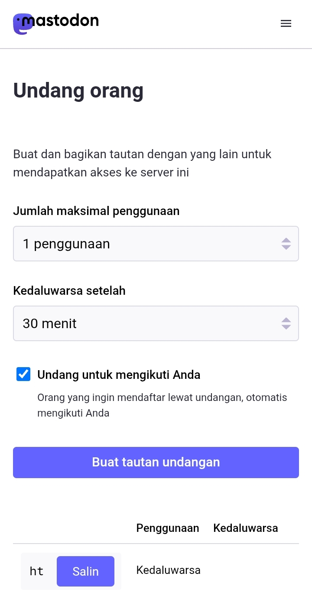

# Mengundang Teman (Opsional)

Di satu titik, adakalanya peladen di mana akunmu menetap sedang membatasi jumlah registrasi publik. Namun di waktu yang sama, ada temanmu yang ingin bergabung di Mastodon.

Rekomendasi saya, kamu bisa **menyarankan temanmu untuk bergabung ke peladen lain yang [masih membuka registrasi publik](https://joinmastodon.org/servers)**, dan walaupun nanti temanmu berbeda peladen denganmu, tenang, dengan keunggulan terfederasi inilah, kamu dan temanmu akan bisa saling terhubung satu sama lain. Kamu dan temanmu tinggal mencari nama pengguna-nya masing-masing di kolom pencarian, dan semestinya akun temanmu di layar kamu (atau akunmu di layar temanmu) muncul di hasil pencarian dan klik ***Ikuti (Follow)***.

Namun pada bagian ini, kamu juga bisa mengundang temanmu dengan mengirim tautan undangan, agar temanmu bisa bergabung ke peladen yang sedang membatasi registrasi publik atau tidak menerima registrasi publik.

Di beranda, klik panel menu -> klik *Pengaturan (Preferences)* -> di halaman berikutnya, klik panel menu -> klik *Undang orang (Invite people)*

  

    
    
    
    
  

Di sini, kalian bisa menentukan jumlah pemakaian tautan undangan (*Jumlah maksimal penggunaan  - Max number of uses*), durasi tautan (*Kedaluwarsa setelah  - Expire after*), dan juga apakah pengguna yang menggunakan tautan undanganmu akan otomatis mengikuti kamu atau tidak. Setelah itu, klik ***Buat tautan undangan (Generate invite link)***.

  

    
    
  

Selesai. Kamu bisa salin dan kirim tautan undangan itu ke temanmu yang memerlukan.

Catatan: **Gunakan fitur tautan undangan ini dengan bijak!** Tidak untuk keperluan peternakan akun, memperlancar skema penipuan, atau kegiatan yang melanggar aturan dan hukum di peladen Mastodon!
