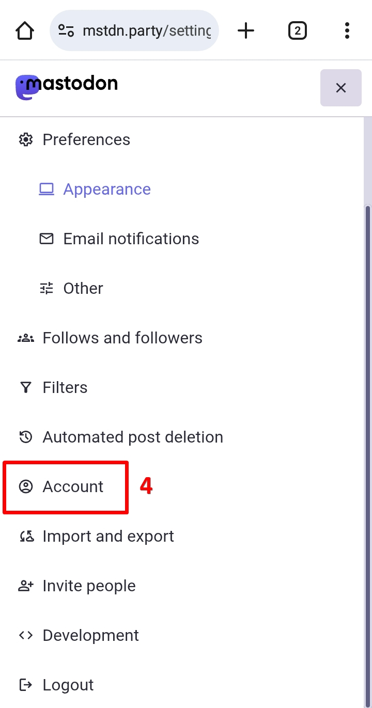

# Migrasi Akun dan Tutup Akun
Adakalanya sebuah peladen Mastodon mengumumkan untuk berhenti beroperasi, sedangkan kamu sudah membangun suatu basis pengikut yang cukup lumayan.

Jika terjadi demikian, mungkin kamu bisa berpikir untuk **pindah dan buat akun ke peladen Mastodon lain yang masih aktif dan kembali membangun basis pengikut di sana**. Dan cara ini adalah **cara yang termudah**.

**Ini juga mengapa saya masih merekomendasikan untuk bergabung di peladen utama yang besar, terutama yang langsung dikelola oleh lembaga utama seperti mastodon.social**, karena adanya jaminan keberlangsungan keberadaan peladen oleh lembaga utama tsb.

Peladen yang dikelola oleh komunitas misalnya, pada satu titik jika terjadi kendala (misal kendala teknis, pembiayaan, krisis moderator, dsb.), seringkali mereka memutuskan untuk menutup peladen yang mereka kelola.

Namun ini juga bukan berarti bahwa peladen mastodon.social juga tidak akan mengalami hal yang sama juga di masa mendatang.

Baik, kembali ke pembahasan migrasi akun: Tetapi ada cara lain. Alih-alih membangun basis pengikut lagi di peladen baru, mengapa tidak basis pengikutmu yang sudah ada juga ikut pindah ke peladen baru?

Mastodon memiliki fitur migrasi akun untuk memindahkan akun kalian dari peladen sebelumnya ke peladen yang baru yang kalian telah pilih.

Mari kita coba buat akun di peladen lain. Untuk contoh di sini, saya memilih peladen **mstdn.party**, dengan nama pengguna `@bandarbaru01@mstdn.party`.

[picture]

Di peladen mstdn.party, kita ke *Preferences* -> klik *Account* -> scroll ke bawah, ke bagian *Moving from a different account*, klik ***create an account alias***.

[picture]

Dari sini, kita masukkan nama pengguna lama kita, yakni contoh di sini adalah: `@bandarbaru01@mastodon.social`.

[picture]

Setelah berhasil, sekarang kita kembali ke halaman akun kita di peladen mastodon.social.

[picture]

Di peladen mastodon.social, kita ke *Preferences* ->klik *Account* -> scroll ke bawah, ke bagian *Pindah ke akun berbeda (Move to  a different account)*, klik ***mengaturnya di sini (configure it here)***.

[picture]

Di sini, kita bisa masukkan alamat nama pengguna baru kita di peladen yang baru kita pilih, serta kata sandi akun kita di peladen yang lama. Klik ***Pindahkan pengikut (Move followers)*** untuk memulai proses.

[picture]

Proses migrasi akun selesai. Sekarang pengikut kita secara otomatis akan dipindahkan untuk mengikuti akun kita yang baru di peladen yang baru.

[picture]

Jika seseorang mengakses akun kita di peladen yang lama, maka akan memunculkan pesan bahwa akun tersebut sudah pindah ke akun yang baru.

[picture]

Setelah kita memindahkan akun, perlu diperhatikan bahwa ada grace period selama 30 hari. Yakni, kita tidak bisa melakukan proses pemindahan akun lagi hingga 30 hari.

[picture]

Sebagian data, seperti:
- daftar orang yang kita ikuti
- postingan yang kita markahi
- sebuah daftar yang berisi akun-akun
- daftar orang yang kita bisukan
- daftar orang yang kita blokir
- peladen yang kita blokir

ini tidak dipindahkan secara otomatis. Untuk itu kalian bisa melakukan proses impor-ekspor.

Baik, setelah kita memindahkan akun kita, di menu pengaturan ->  klik *Impor dan Ekspor (Import and Export)*

[picture]

Di sini, kita bisa mengklik ***Meminta arsip anda (Request your archive)***

[picture]

Tunggu beberapa saat, hingga data kita berhasil terproses. Setelah data terproses, halaman ini akan menampilkan berkas yang dapat kita unduh.

Setelah kita mengunduh arsip data kita, kita ke peladen yang baru, kita ke pengaturan -> klik *Import and Export* -> klik *Import*

[picture]

Di sini, kita bisa memilih arsip data kita tersebut yang akan kita unggah, lalu pilih data apa yang akan kita pindahkan ke akun baru, lalu pilih apakah datanya di-*merge* (digabungkan) atau di-*overwrite* (diganti, disesuaikan dengan arsip data tersebut). Klik ***Upload*** untuk memulai prosesnya.

[picture]

Proses migrasi akun selesai, dan sekarang kita sudah berada di akun yang baru.

## Menghapus Akun

Apakah kalian berpikir untuk hapus akun? Mungkin kamu merasa ada defiensi dan mempertimbangkan hal-hal lain untuk meninggalkan dan berhenti menggunakan Mastodon. Daripada meninggalkan Mastodon dengan masih meninggalkan postingan atau gambar yang dapat menjadi masalah privasi bagi kamu di masa mendatang, lebih baik kamu menghapus akunmu sebelum meninggalkan dan berhenti menggunakan Mastodon.

Baik, di beranda, klik panel menu -> klik *Pengaturan (Preferences)* -> di halaman berikutnya, klik panel menu -> klik *Akun (Account)* -> scroll ke bawah, di bagian *Hapus akun (Delete account)*, klik ***memproses ini (proceed here)***.

  

    
    
    
    
    
  

Perhatikan catatannya: **akun yang telah dihapus tidak dapat diaktifkan kembali**, **nama pengguna yang telah dihapus tidak dapat lagi digunakan ketika kamu mencoba mendaftar kembali**, seluruh data kamu di Mastodon terhapus, namun data kamu mungkin masih tersimpan di peladen lain (terutama jika peladen itu menggunakan sistem yang berbeda dari Mastodon).

  

    
  

Jika sudah, masukkan kata sandi, dan klik ***Hapus akun (Delete account)***.

Selesai. Semoga bisa bertemu lagi di lain waktu dan di lain kesempatan.

